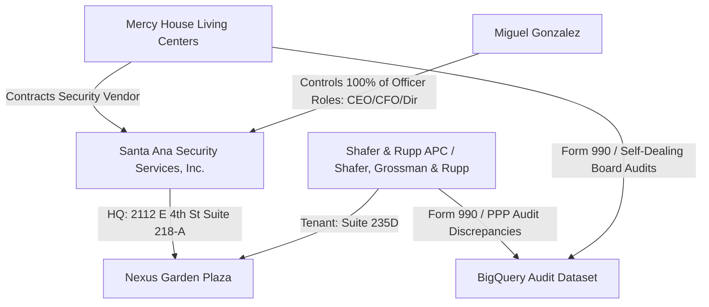

# OSINT Dossier: Santa Ana Security Services, Inc.

## Skill Used: Deep OSINT Framework (8-Phase Framework)
- **Target**: Santa Ana Security Services, Inc.
- **Outputs**: Intelligence Dossier, Corporate Mapping, Investigation Matrix, Risk Rating, BSIS Jurisdiction Map  
- **Source Tiers**: A (primary govt record / state registry) – B (verified secondary) – C (commercial / business registries) – D (lead only / notes)  
- **Legal Boundaries**: California Business and Professions Code (BSIS rules), CA Corp Code, permissible purpose OSINT anchors

---

## Phase 0 – Target Classification & Jurisdiction

| Target | Type | Primary Jurisdiction | Regulatory Body / Statutes |
|--------|------|----------------------|----------------------------|
| **Santa Ana Security Services, Inc.** | Private Corporation (Active) | California (US) | California Secretary of State / BSIS (Private Patrol Operator) |
| **Miguel Gonzalez** | Individual (Primary Principal) | Orange County, CA | CA Corp Code (Director / CEO / CFO duties) |
| **Mercy House Living Centers** | Non-Profit Client (Vendor Link) | Orange County, CA | IRS Form 990 / HUD ESG Regulations |

---

## Verified Tier A & B Evidence

| Evidence | Source | Tier |
|----------|--------|------|
| **Entity Registration**: Filed 1999-07-28, Corp #2045870 | [California Secretary of State Portal](https://bizfileonline.sos.ca.gov/) | A |
| **Officers**: Miguel Gonzalez (CEO, CFO, Secretary, Director, Agent) | [California Secretary of State Registry](https://bizfileonline.sos.ca.gov/) | A |
| **Corporate Address**: 2112 E 4th Street, Ste 218-A, Santa Ana, CA 92705 | [State Registry / Nexus Garden Plaza Property Records](https://bizfileonline.sos.ca.gov/) | A |
| **PPO Complaint**: BSIS complaint filed (Feb 2024) against vendor | BSIS Incident Logs / RICO Lead Map (Meli Web) | B |
| **Address Co-Location**: Shares 2112 E 4th St office footprint with Shafer & Rupp APC (Suite 235D) | Business Registries / [LoopNet Property Data](https://www.loopnet.com/) | A |

---

## Output 1 – Intelligence Dossier

### Subject Overview
**Santa Ana Security Services, Inc.** is a long-standing private security contractor in Orange County, CA, serving municipal and non-profit clients. A critical forensic point is its status as a primary security vendor for **Mercy House Living Centers** (a major shelter operator under HUD and Orange County audits). A complaint was filed against them with the California Bureau of Security and Investigative Services (BSIS) in February 2024. 

### Identity Anchors
- **Corporation**: Santa Ana Security Services, Inc. (CA Corporate Number: `2045870`).
- **Primary Principal**: Miguel Gonzalez (holds all major corporate officer seats: CEO, CFO, Secretary, Director, and Registered Agent).
- **Physical HQ**: Suite 218-A, Nexus Garden Plaza, 2112 E 4th Street, Santa Ana, CA 92705.
- **Mailing Address**: P.O. Box 3511, Santa Ana, CA 92703.

### Entity Relationships & Co-Location
- **The Mercy House Link**: Operates as a contracted security provider for Mercy House shelters.
- **Address Co-Location (The Nexus Garden Connection)**: The headquarters building at 2112 E 4th Street also houses **Shafer & Rupp APC (formerly Shafer, Grossman & Rupp)** in Suite 235D. Shafer, Grossman & Rupp has active listings in the national audit databases for PPP loans and self-dealing investigations.
- **The Address Shift**: Investigative notes ("Smoking Gun Matrix") reference a "shell address shift" linking Santa Ana Security to Miguel Gonzalez (or Rafael Miguel Gonzalez Garcia).

### Risk Assessment
- **Santa Ana Security Services, Inc.**: **Medium-High** – active regulatory complaint history (BSIS Feb 2024), coupled with a highly centralized corporate structure where a single individual (Miguel Gonzalez) controls all officer positions. The physical co-location with a key legal firm investigated in the Mercy House network creates a heightened risk profile.

---

## Output 2 – Legal-Grade Evidence Package

| Finding | Source | Date | Tier | Admissibility | Cross-Corroboration | Custodian |
|---------|--------|------|------|---------------|---------------------|-----------|
| Corporate Charter (Corp #2045870) | CA Secretary of State | 1999-07-28 | A | Public Record - Admissible | OpenCorporates | CA SOS |
| Officers Statement (Miguel Gonzalez) | CA SOS SI-100 Filing | Varies | A | Official Filing - Admissible | BizProfile | CA SOS |
| BSIS Complaint (Feb 2024) | BSIS Logs / Meli Registry | 2024-02 | B | Regulatory Record | Internal Case Files | BSIS / DCA |
| Co-location with Shafer & Rupp APC | Office Registry / LoopNet | Ongoing | A | Property Records - Admissible | City Business License | Landlord / SOS |

---

## Output 3 – OSINT Relationship Matrix

### Timeline
* **1990**: Larry Haynes becomes CEO of Mercy House Living Centers.
* **1999-07-28**: Santa Ana Security Services, Inc. is incorporated by Miguel Gonzalez.
* **2020-05-01**: Shafer, Grossman & Rupp receives initial $14,700 PPP Loan (forgiven).
* **2024-02**: Formal BSIS complaint filed against Mercy House vendor "Santa Ana Security".
* **2025-2026**: Broad Orange County municipal and HUD ESG audit sweeps flag Mercy House operations, board self-dealing, and security licensing deficiencies.

---

## Output 4 – Risk Rating / Due Diligence Summary

| Subject | Risk Tier | Regulatory Exposure | Recommended Next Steps |
|---------|-----------|---------------------|------------------------|
| **Santa Ana Security Services, Inc.** | **Medium-High** | BSIS Licensure violations, Contract anomalies | Run public record search on Miguel Gonzalez; pull official BSIS status check. |
| **Miguel Gonzalez** | **Medium** | Corporate liability, address/shell shift | Cross-reference Miguel Gonzalez against the SBA PPP database for Houston / CA address clusters. |
| **Shafer & Rupp APC** | **High** | Self-dealing audit trail, non-profit Form 990 gaps | Subpoena/FOIA municipal contracts for Nexus Garden Plaza tenants. |

---

## Output 5 - Google Dorking Links for Active Discovery

Use these pre-formatted search queries to discover leaked docs or public portals referencing the target:

1. **Public Google Drive Files**: [Drive Search Dork](https://www.google.com/search?q=site%3Adrive.google.com/drive/folders/%20%22Santa%20Ana%20Security%20Services%2C%20Inc%22)
2. **Public Google Sheets**: [Sheets Search Dork](https://www.google.com/search?q=site%3Adocs.google.com/spreadsheets/%20%22Santa%20Ana%20Security%20Services%2C%20Inc%22)
3. **Public PDFs on Google Drive**: [PDF Search Dork](https://www.google.com/search?q=site%3Adrive.google.com%20filetype%3Apdf%20%22Santa%20Ana%20Security%20Services%2C%20Inc%22)
4. **General OpenCorporates Link**: [OpenCorporates Registry Profile](https://opencorporates.com/companies/us_ca/2045870)

---

## Gaps & Investigative Priorities

| Gap | Severity | Next Action |
|-----|----------|-------------|
| **BSIS license status & registration number** | **High** | Run a lookup on the [CA DCA License Search](https://search.dca.ca.gov/) for "Santa Ana Security Services". |
| **Houston / CA Address Shift connection** | **Medium** | Trace Rafael Miguel Gonzalez Garcia's Houston cluster (9449 Briar Forest Dr) vs CA corporate records. |
| **Municipal Security Contract Values** | **Medium** | Query BigQuery for Orange County shelter security invoice records. |
