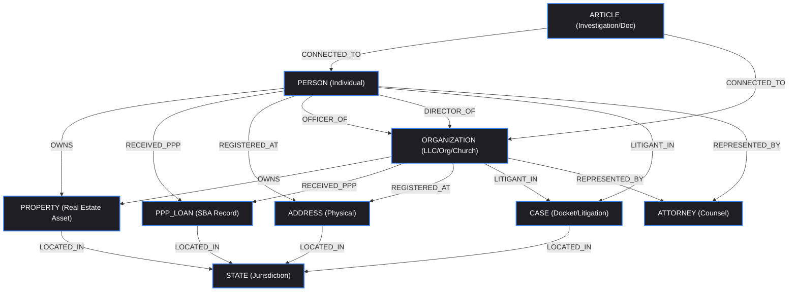

# OSINTNeoAI-Core Architectural Consolidation Plan
**Document Version:** 1.0.0  
**Current Local Time:** 2026-07-03  
**Status:** PROPOSED (Pending User Approval)

---

## Executive Summary
This document provides a non-destructive forensic analysis of the local repositories (`riconow` / `AG2OSINTNEOMAXX` / `opencode_work`, `osint-agent`, `NPI` data engines, and `OSINTNeoAI`). The target is to design **OSINTNeoAI-Core**—a unified, consolidated codebase that standardizes ingestion, entity resolution, and graph-database network mapping.

> [!IMPORTANT]
> **Strict No-Modification Guarantee:** No files have been edited, created, or deleted on the local system during this analysis. This plan is presented purely for structural design review and requires explicit user consent before execution.

---

## A. Repository Inventory
The following physical directories host the existing system capabilities:

1. **`riconow` (Primary Active Workspace)**
   - **Local Path:** `C:\Users\HP\OneDrive\Documents\AG2OSINTNEOMAXX` (Synchronized with `Tonypost949/riconow`)
   - **Role:** Houses core ingestion connectors (e.g., OneDrive, local disks), real-time synchronization utilities (`git_autopush.py`), and the custom `.agents` subagent configuration workspace (`deep-osint` skill).
   - **Active Files/Subfolders:** `aegis_correlation_engine.py`, `onedrive_ingestion_engine.py`, `qag2-osint-extension/`.

2. **`osint-agent` (Local Execution & Interaction Agent)**
   - **Local Path:** `C:\Users\HP\OneDrive\Documents\opencode_work\OSINT_VAULT_BACKUP`
   - **Role:** Provides autonomous agent loops, Google API scraping/scanning connectors (Drive, Gmail, Photos), notification triggers, and Maltego mapping transforms.
   - **Active Files/Subfolders:** `agent.py`, `live_agent_loop.py`, `run_agent.py`, `scan_drive.py`, `scan_gmail.py`, `generate_maltego.py`.

3. **`NPI` (National Provider/EIN Data Processing Engine)**
   - **Local Path:** Spread across `C:\Users\HP\OneDrive\Documents\opencode_work` and datasets
   - **Role:** Handles high-volume entity cross-referencing between National Provider Index (NPPES), IRS EIN registries, out-of-state LLC records, and SBA PPP loan registries.
   - **Active Files/Subfolders:** `nppes_export_irs_ein_oc_lb_health.csv`, `nppes_export_oc_lb_orgs.csv`, `bq_llc_owners_npppes.csv`.

4. **`OSINTNeoAI` (Web Platform UI & Analytics Workbench)**
   - **Local Path:** `C:\Users\HP\OneDrive\Documents\OsintNeoAi` (and `GitHub\OsintNeoAi`)
   - **Role:** Powers interactive browser-based interfaces, local workbook loaders, and custom civil rights compliance logs.
   - **Active Files/Subfolders:** `OSINT911Ai`, `OSINT_Civil_Rights_Integration_Guide.md`, `business_workbook_engine.py`, `people-extraction-workbook.py`, `osint_neo_ai (1).html`.

---

## B. Capabilities by Repository

| Repository | Primary Strengths & Capabilities |
| :--- | :--- |
| **`riconow`** | Ingesting files from OneDrive and local folders; Git synchronization automation; running local forensic OCR loops; executing BigQuery analytical queries. |
| **`osint-agent`** | Orchestrating autonomous loops; indexing and searching raw Google Drive indexes; auditing Gmail/Photos data; converting unstructured text to Maltego networks. |
| **`NPI`**| Heavyweight fuzzy string matching; resolution of doctors, healthcare providers, and entities from NPPES records to PPP/LLC matrices; structured BigQuery table updates. |
| **`OSINTNeoAI`** | Interactive front-end visual mapping; compiling HTML directories; loading business and people workbooks directly into Excel/CSV interfaces. |

---

## C. Duplicate Functionality
We identified significant overlap across the repositories, which leads to maintenance fatigue and database drift. Consolidating these is the primary goal of `OSINTNeoAI-Core`.

*   **Google Drive Indexing & Searching:**
    *   `AG2OSINTNEOMAXX\.agents\skills\deep-osint\scripts\search_drive.py` (Interactive Dashboard + Search API)
    *   `opencode_work\OSINT_VAULT_BACKUP\search_drive.py` and `scan_drive.py` (Local background indexer)
    *   *Resolution:* Merge into a single `connectors/gdrive_connector.py`.
*   **Gmail / Email Auditing:**
    *   `AG2OSINTNEOMAXX\scratch\automated_gmail_scan.py`
    *   `opencode_work\OSINT_VAULT_BACKUP\scan_gmail.py` and `scan_gmail_resumable.py`
    *   *Resolution:* Consolidate into `connectors/gmail_connector.py` supporting resumable offsets.
*   **Matrix Building & Entity Correlation:**
    *   `opencode_work\build_matrix.py` / `build_matrix_v2.py`
    *   `opencode_work\OSINT_VAULT_BACKUP\build_matrix.py` / `build_matrix_v2.py`
    *   `AG2OSINTNEOMAXX\aegis_correlation_engine.py`
    *   *Resolution:* Merge into a highly optimized core `processing/correlation_engine.py`.
*   **Maltego Entity Generation:**
    *   `AG2OSINTNEOMAXX\.agents\skills\deep-osint\scripts\gemini_osint_transform.py`
    *   `opencode_work\OSINT_VAULT_BACKUP\generate_maltego.py`
    *   *Resolution:* Consolidate into `graph/maltego_generator.py`.

---

## D. Reusable Components
To transition to a modular architecture, scripts have been classified into four foundational pillars:

### 1. Data Ingestion & Connectors (`connectors/`)
*   **`onedrive_ingestion_engine.py`:** OneDrive file indexing and retrieval.
*   **`scan_drive.py` / `search_drive.py`:** Standardized Google Drive scraper and API interface.
*   **`scan_gmail.py` / `scan_gmail_resumable.py`:** Resumable mailbox scraper.
*   **`scan_google_photos.py`:** Google Photos metadata extraction.
*   **`azure_ocr_permits.py` / `ocr_bulk_scanner.py`:** OCR pipelines utilizing Azure/Tesseract.

### 2. Entity Resolution & Cleaning (`processing/`)
*   **`aegis_correlation_engine.py`:** Core cross-referencing logic linking corporate owners to targets.
*   **`business_workbook_engine.py`:** Excel business record resolver and parser.
*   **`fuzzy_church_match.py`:** Name/address fuzzy matching utilities.
*   **`nppes_export_*` utilities:** Processing healthcare entities and IRS EIN registrations.

### 3. Graph Schema & Network Mapping (`graph/`)
*   **`build_network_map.py` / `build_network_local.py`:** Generates interactive spatial and network maps.
*   **`generate_maltego.py` / `gemini_osint_transform.py`:** Maps text to structured XML elements for Maltego link-analysis.
*   **`live_gis_to_json.py`:** Extracts spatial coordinates of entities to plot nodes on GIS layers.

### 4. Agent Orchestration (`agent/`)
*   **`live_agent_loop.py` / `run_agent.py`:** The main autonomous system loops driving background collection.
*   **`ai_connector.py`:** Bridges local scripts to Gemini or Azure cognitive APIs.

---

## E. Recommended OSINTNeoAI-Core structure
To construct a unified platform, we recommend a single, cohesive modular repository structure:

```directory
OSINTNeoAI-Core/
│
├── .github/                  # CI/CD workflows and action triggers
├── config/                   # Global JSON configurations and API credentials
│   ├── config.json.example
│   └── schema.json           # Unified JSON Validation Schema
│
├── connectors/               # Pillar 1: Multi-Channel Data Ingestion
│   ├── __init__.py
│   ├── gdrive_connector.py   # Merged search_drive & scan_drive
│   ├── gmail_connector.py    # Merged scan_gmail (resumable)
│   ├── onedrive_connector.py # Merged onedrive_ingestion_engine
│   └── ocr_connector.py      # Merged Tesseract/Azure OCR pipelines
│
├── processing/               # Pillar 2: Normalization & Entity Resolution
│   ├── __init__.py
│   ├── clean_pipeline.py     # Schema checking & field cleaning
│   ├── correlation.py        # Aegis correlation engine
│   └── npi_processor.py      # NPPES, IRS EIN, and LLC parsing logic
│
├── graph/                    # Pillar 3: Graph Modeling & Network Exports
│   ├── __init__.py
│   ├── schema.py             # Declarative Neo4j/Cypher mapping
│   ├── graph_builder.py      # Translates CSV/Dataframes to graph format
│   ├── maltego_exporter.py   # Merged generate_maltego scripts
│   └── spatial_mapper.py     # Live GIS mapper to GeoJSON
│
├── agent/                    # Pillar 4: AI Agent Loops & CLI
│   ├── __init__.py
│   ├── core_agent.py         # Merged live_agent_loop & run_agent
│   └── ai_client.py          # Standardized LLM interactions API
│
├── tests/                    # Comprehensive unit & integration testing
│   ├── test_connectors.py
│   └── test_resolution.py
│
├── requirements.txt          # Unified dependencies list
└── README.md                 # Core system documentation
```

---

## F. Proposed Graph Schema
The graph model is designed to represent complex patterns in public records (e.g., real estate, litigation, and loans). It establishes clean boundaries between people, entities, and locations.

### 1. Node Types (Labels)
- **`PERSON`**: An individual investigator, attorney, corporate officer, or taxpayer.
- **`ORGANIZATION`**: A corporate entity, LLC, nonprofit, church, lender, or public municipality.
- **`ADDRESS`**: A physical street address or registered location.
- **`PROPERTY`**: A specific parcel, tract, or real estate asset identified by APN (Assessor's Parcel Number).
- **`PPP_LOAN`**: A federal Paycheck Protection Program loan record.
- **`CASE`**: A civil, criminal, or administrative docket/case record.
- **`ATTORNEY`**: A legal representative/counsel associated with litigation.
- **`STATE`**: A US state jurisdiction (e.g., California, Arizona).
- **`ARTICLE`**: An investigative journalism piece, whistleblower briefing, or news article.

### 2. Relationship Types
- **`OWNS`**: `[PERSON|ORGANIZATION] -> OWNS -> [PROPERTY]`
- **`RECEIVED_PPP`**: `[PERSON|ORGANIZATION] -> RECEIVED_PPP -> [PPP_LOAN]`
- **`REGISTERED_AT`**: `[PERSON|ORGANIZATION] -> REGISTERED_AT -> [ADDRESS]`
- **`LOCATED_IN`**: `[ADDRESS|PROPERTY|PPP_LOAN|CASE] -> LOCATED_IN -> [STATE]`
- **`OFFICER_OF`**: `[PERSON] -> OFFICER_OF -> [ORGANIZATION]`
- **`DIRECTOR_OF`**: `[PERSON] -> DIRECTOR_OF -> [ORGANIZATION]`
- **`LITIGANT_IN`**: `[PERSON|ORGANIZATION] -> LITIGANT_IN -> [CASE]`
- **`REPRESENTED_BY`**: `[PERSON|ORGANIZATION] -> REPRESENTED_BY -> [ATTORNEY]`
- **`CONNECTED_TO`**: `[ANY] -> CONNECTED_TO -> [ANY]` (Fuzzy match / indirect linkage)

### 3. Graph Schema Relationships Diagram (Mermaid)



---

## G. Recommended Merge & Migration Strategy
To merge files without causing system breakdown, we recommend a phased approach:

1. **Phase 1: Environment Setup & Target Directory Initialization**
   - Create the target folder structures without moving active files.
   - Synchronize configurations and establish a baseline `requirements.txt`.
2. **Phase 2: Ingestion & Connector Consolidation (Pillar 1)**
   - Unify Google and OneDrive API controllers into the `connectors/` directory.
   - Run isolated unit tests to ensure credentials authentication remains unbroken.
3. **Phase 3: Entity Resolution Engine Unification (Pillar 2)**
   - Port Aegis and workbook-resolution files into `processing/`.
   - Setup schema mapping templates to standard fields.
4. **Phase 4: Graph Database Schema & Export Porting (Pillar 3)**
   - Port GIS mapping and Maltego XML export scripts into `graph/`.
   - Deploy declarative Cypher query definitions.
5. **Phase 5: Agent Core Deployment (Pillar 4)**
   - Move main autonomous agent scripts into `agent/`.
   - Update integration routes to access the newly refactored directories.

---
**Prepared by:** Antigravity AI  
**Pair-Programming Partner:** user  
*Please review this consolidation plan. Ready to execute upon explicit confirmation.*
