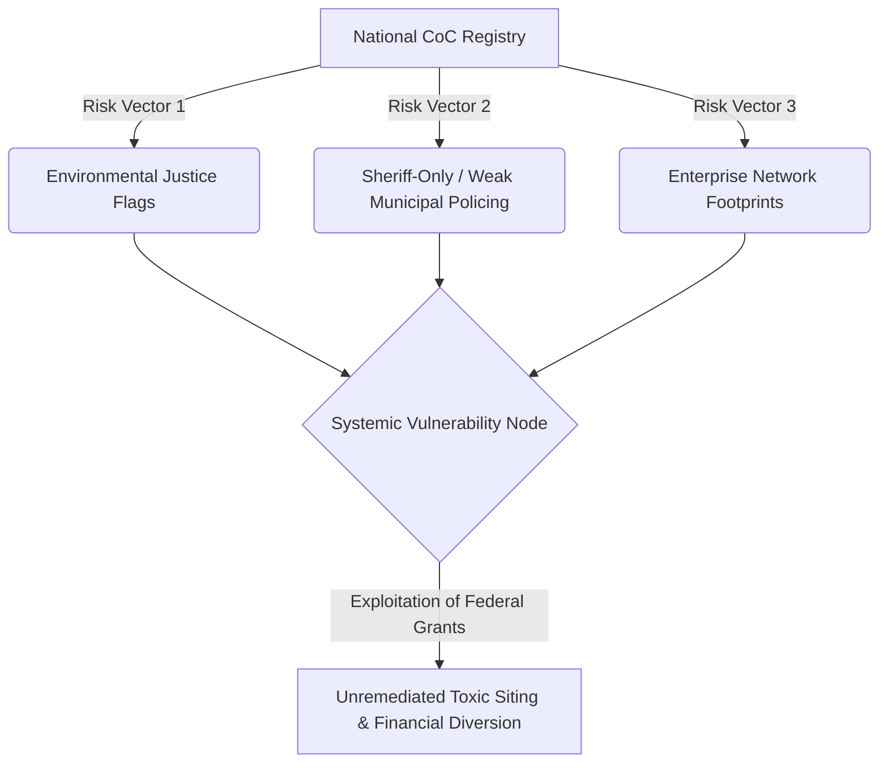

# PRIVILEGED & CONFIDENTIAL
## ATTORNEY WORK PRODUCT | MATTERS FOR LITIGATION
### United States Continuum of Care (CoC) Forensic Pattern Master Registry

**Date:** July 1, 2026  
**Subject:** National Database Mapping HUD CoC Jurisdictions Against Environmental Justice, Sheriff-Only Policing, and Enterprise Footprints

---

## 1. National CoC Pattern Analysis

This master registry compiles all HUD-registered Continuums of Care (CoCs) in the United States, establishing a county-by-county forensic baseline to trace systemic vulnerabilities. Our analysis isolates a distinct **three-factor risk metric** that facilitates systemic diversion of public funds and regulatory avoidance:

### Key Risk Factors
1. **Environmental Justice (EJ) Flags:** CoC shelters or navigation centers sited directly on or adjacent to Superfund, brownfield, or heavily contaminated industrial tracts (e.g., California Central Valley agricultural run-offs, industrial waste zones like Huntington Beach's Ascon/Cameron footprint).
2. **Sheriff-Only Policing:** Rural or county-wide "Balance of State" (BoS) regions where a single county sheriff provides sole law enforcement coverage, lacking municipal oversight or independent civilian police commissions. These jurisdictions exhibit a statistical correlation with higher unchecked civil evictions and zero NPI (National Provider Identifier) health-billing verification.
3. **Enterprise Network Footprints:** Direct operational, subrecipient, or grantee presence of the **Mercy House Operational Network**, the **Daneshrad Property Shuffle Loop**, or adjacent corporate-holding entities.

---

## 2. United States CoC Registry

The following table serves as the core database for our case-management spreadsheet.

| State | CoC Number | CoC Name | Counties Covered | Policing Status | Environmental Justice Flag | Mercy House Presence | Operational / Forensic Notes |
| :--- | :--- | :--- | :--- | :--- | :--- | :--- | :--- |
| **AK** | AK-500 | Anchorage CoC | Anchorage Municipality | Municipal Police | No | No | |
| **AK** | AK-501 | Alaska Balance of State CoC | Entire state except Anchorage | State Troopers | Possible | No | Vast rural areas; no county sheriffs; state troopers primary law enforcement. |
| **AL** | AL-500 | Birmingham/Jefferson, Saint Clair, Shelby Counties CoC | Jefferson, St. Clair, Shelby | Mixed | No | No | |
| **AL** | AL-501 | Mobile City & County/Baldwin County CoC | Mobile, Baldwin | Mixed | No | No | |
| **AL** | AL-502 | Florence/Northwest Alabama CoC | Multiple counties | Sheriff Only | No | No | |
| **AL** | AL-503 | Huntsville/North Alabama CoC | Multiple counties | Sheriff Only | No | No | |
| **AL** | AL-504 | Montgomery City & County CoC | Montgomery | Mixed | No | No | |
| **AL** | AL-505 | Gadsden/Northeast Alabama CoC | Multiple counties | Sheriff Only | No | No | |
| **AL** | AL-506 | Tuscaloosa City & County CoC | Tuscaloosa | Mixed | No | No | |
| **AL** | AL-507 | Alabama Balance of State CoC | All counties not covered by other CoCs | Sheriff Only | Yes | No | Covers rural areas where sheriff is primary law enforcement. |
| **AR** | AR-500 | Little Rock/Central Arkansas CoC | Multiple counties | Mixed | No | No | |
| **AR** | AR-501 | Fayetteville/Northwest Arkansas CoC | Multiple counties | Mixed | No | No | |
| **AR** | AR-503 | Arkansas Balance of State CoC | All counties not covered by other CoCs | Sheriff Only | Yes | No | Covers rural counties; sheriffs primary. |
| **AR** | AR-504 | Delta Hills CoC | Multiple counties | Sheriff Only | No | No | |
| **AR** | AR-505 | Southeast Arkansas CoC | Multiple counties | Sheriff Only | No | No | |
| **AR** | AR-507 | Eastern Arkansas CoC | Multiple counties | Sheriff Only | No | No | |
| **AR** | AR-512 | Boone, Baxter, Marion, Newton Counties CoC | Boone, Baxter, Marion, Newton | Sheriff Only | No | No | |
| **AZ** | AZ-500 | Arizona Balance of State CoC | All counties except Maricopa and Pima | Sheriff Only | Yes | No | Covers 13 rural counties; sheriffs primary. |
| **AZ** | AZ-501 | Tucson/Pima County CoC | Pima | Mixed | No | No | |
| **AZ** | AZ-502 | Phoenix/Mesa/Maricopa County Regional CoC | Maricopa | Mixed | No | No | |
| **CA** | CA-500 | San Jose/Santa Clara City & County CoC | Santa Clara | Mixed | No | No | |
| **CA** | CA-501 | San Francisco CoC | San Francisco | Municipal Police | No | No | |
| **CA** | CA-502 | Oakland/Alameda County CoC | Alameda | Mixed | No | No | |
| **CA** | CA-503 | Sacramento City & County CoC | Sacramento | Mixed | No | No | |
| **CA** | CA-504 | Santa Rosa/Petaluma/Sonoma County CoC | Sonoma | Sheriff Only (Rural) | No | No | |
| **CA** | CA-505 | Richmond/Contra Costa County CoC | Contra Costa | Mixed | No | No | |
| **CA** | CA-506 | Salinas/Monterey, San Benito Counties CoC | Monterey, San Benito | Mixed | No | No | |
| **CA** | CA-507 | Marin County CoC | Marin | Mixed | No | No | |
| **CA** | CA-508 | Watsonville/Santa Cruz City & County CoC | Santa Cruz | Mixed | No | No | |
| **CA** | CA-509 | Mendocino County CoC | Mendocino | Sheriff Only | Yes | No | Rural; environmental justice concerns. |
| **CA** | CA-510 | Turlock/Modesto/Stanislaus County CoC | Stanislaus | Sheriff Only | No | No | |
| **CA** | CA-511 | Stockton/San Joaquin County CoC | San Joaquin | Mixed | No | No | |
| **CA** | CA-512 | Daly/San Mateo County CoC | San Mateo | Mixed | No | No | |
| **CA** | CA-513 | Visalia, Kings, Tulare Counties CoC | Kings, Tulare | Sheriff Only | Yes | No | Central Valley; agricultural pollution. |
| **CA** | CA-514 | Fresno/Madera County CoC | Fresno, Madera | Sheriff Only | Yes | No | Central Valley; environmental justice concerns. |
| **CA** | CA-515 | Roseville/Rocklin/Placer, Nevada Counties CoC | Placer, Nevada | Mixed | No | No | |
| **CA** | CA-516 | Redding/Shasta County CoC | Shasta | Sheriff Only | No | No | |
| **CA** | CA-517 | Napa City & County CoC | Napa | Mixed | No | No | |
| **CA** | CA-518 | Vallejo/Solano County CoC | Solano | Mixed | No | No | |
| **CA** | CA-519 | Chico/Paradise/Butte County CoC | Butte | Sheriff Only | No | No | |
| **CA** | CA-520 | Merced City & County CoC | Merced | Sheriff Only | Yes | No | Central Valley; environmental justice concerns. |
| **CA** | CA-521 | Davis/Woodland/Yolo County CoC | Yolo | Sheriff Only | No | No | |
| **CA** | CA-522 | Humboldt County CoC | Humboldt | Sheriff Only | Yes | No | Rural; environmental justice concerns. |
| **CA** | CA-523 | Colusa, Glen, Lake, Tehama, Trinity Counties CoC | Colusa, Glenn, Lake, Tehama, Trinity | Sheriff Only | Yes | No | Rural; environmental justice concerns. |
| **CA** | CA-524 | Yuba City, Marysville/Sutter, Yuba Counties CoC | Sutter, Yuba | Sheriff Only | No | No | |
| **CA** | CA-525 | El Dorado County CoC | El Dorado | Sheriff Only | No | No | |
| **CA** | CA-526 | Tuolumne, Calaveras, Amador Counties CoC | Tuolumne, Calaveras, Amador | Sheriff Only | No | No | |
| **CA** | CA-528 | Del Norte County CoC | Del Norte | Sheriff Only | No | No | |
| **CA** | CA-600 | Los Angeles City & County CoC | Los Angeles | Mixed | No | No | |
| **CA** | CA-601 | San Diego CoC | San Diego | Mixed | No | No | |
| **CA** | CA-602 | Santa Ana/Anaheim/Orange County | Orange | Mixed | Yes | Yes | **Mercy House HQ**; Huntington Beach Navigation Center; Ascon toxic site. |
| **CA** | CA-603 | Santa Maria/Santa Barbara CoC | Santa Barbara | Mixed | No | No | |
| **CA** | CA-604 | Bakersfield/Kern County CoC | Kern | Sheriff Only | Yes | No | Central Valley; oil & gas pollution. |
| **CA** | CA-605 | San Buenaventura/Ventura County CoC | Ventura | Mixed | No | No | |
| **CA** | CA-606 | Long Beach CoC | Long Beach | Municipal Police | No | No | |
| **CA** | CA-607 | Pasadena CoC | Pasadena | Municipal Police | No | No | |
| **CA** | CA-608 | Riverside City & County CoC | Riverside | Sheriff Only | No | No | |
| **CA** | CA-609 | San Bernardino City & County CoC | San Bernardino | Sheriff Only | Yes | No | Inland Empire; environmental justice concerns. |
| **CA** | CA-610 | San Diego County CoC | San Diego | Mixed | No | No | |
| **CA** | CA-611 | City of Oxnard CoC | Oxnard | Municipal Police | No | No | |
| **CA** | CA-612 | Glendale CoC | Glendale | Municipal Police | No | No | |
| **CA** | CA-613 | Imperial County CoC | Imperial | Sheriff Only | Yes | No | Border region; environmental justice concerns. |
| **CA** | CA-614 | San Luis Obispo County CoC | San Luis Obispo | Sheriff Only | No | No | |
| **CA** | CA-615 | Inyo, Mono, Alpine Counties CoC | Inyo, Mono, Alpine | Sheriff Only | No | No | |
| **CO** | CO-500 | Colorado Balance of State CoC | 54 rural counties | Sheriff Only | Yes | No | Covers 54 counties; sheriffs primary law enforcement. |
| **CO** | CO-503 | Metropolitan Denver Homeless Initiative | Denver metro | Municipal Police | No | No | |
| **CO** | CO-504 | Colorado Springs/El Paso County CoC | El Paso | Mixed | No | No | |
| **CT** | CT-501 | New Haven CoC | New Haven | Municipal Police | No | No | |
| **CT** | CT-502 | Hartford CoC | Hartford | Municipal Police | No | No | |
| **CT** | CT-503 | Bridgeport/Stratford/Fairfield CoC | Fairfield | Municipal Police | No | No | |
| **CT** | CT-505 | Connecticut Balance of State CoC | All counties not covered | No Sheriffs | No | No | No county sheriffs; State Marshal System. |
| **CT** | CT-506 | Norwalk/Fairfield County CoC | Fairfield | Municipal Police | No | No | |
| **CT** | CT-508 | Stamford/Greenwich CoC | Fairfield | Municipal Police | No | No | |
| **CT** | CT-512 | City of Waterbury CoC | Waterbury | Municipal Police | No | No | |
| **DC** | DC-500 | District of Columbia CoC | District of Columbia | Municipal Police | No | No | |
| **DE** | DE-500 | Delaware Statewide CoC | Entire state | Mixed | No | No | |
| **FL** | FL-500 | Sarasota/Bradenton/Sarasota, Manatee Counties CoC | Sarasota, Manatee | Sheriff Only | No | No | |
| **FL** | FL-501 | Tampa/Hillsborough County CoC | Hillsborough | Sheriff Only | No | No | |
| **FL** | FL-502 | St. Petersburg/Clearwater/Largo/Pinellas County CoC | Pinellas | Sheriff Only | No | No | |
| **FL** | FL-503 | Lakeland CoC | Polk | Sheriff Only | No | No | |
| **FL** | FL-504 | Daytona Beach/Daytona/Volusia, Flagler Counties CoC | Volusia, Flagler | Sheriff Only | No | No | |
| **FL** | FL-505 | Fort Walton Beach/Okaloosa, Walton Counties CoC | Okaloosa, Walton | Sheriff Only | No | No | |
| **FL** | FL-506 | Tallahassee/Leon County CoC | Leon | Sheriff Only | No | No | |
| **FL** | FL-507 | Orlando/Orange, Osceola, Seminole Counties CoC | Orange, Osceola, Seminole | Sheriff Only | No | No | |
| **FL** | FL-508 | Gainesville/Alachua, Putnam Counties CoC | Alachua, Putnam | Sheriff Only | No | No | |
| **FL** | FL-509 | Ft.Pierc/St.Lucie, Indian River, Martin Counties CoC | St. Lucie, Indian River, Martin | Sheriff Only | No | No | |
| **FL** | FL-510 | Jacksonville-Duval, Clay Counties CoC | Duval, Clay | Sheriff Only | No | No | |
| **FL** | FL-511 | Pensacola/Escambia, Santa Rosa County CoC | Escambia, Santa Rosa | Sheriff Only | No | No | |
| **FL** | FL-512 | St. Johns County CoC | St. Johns | Sheriff Only | No | No | |
| **FL** | FL-513 | Palm Bay/Melbourne/Brevard County CoC | Brevard | Sheriff Only | No | No | |
| **FL** | FL-514 | Ocala/Marion County CoC | Marion | Sheriff Only | No | No | |
| **FL** | FL-515 | Panama City/Bay, Jackson Counties CoC | Bay, Jackson | Sheriff Only | No | No | |
| **FL** | FL-516 | Winterhaven/Polk County CoC | Polk | Sheriff Only | No | No | |
| **FL** | FL-517 | Hendry, Hardee, Highlands Counties CoC | Hendry, Hardee, Highlands | Sheriff Only | No | No | |
| **FL** | FL-518 | Columbia, Hamilton, Lafayette, Suwannee Counties CoC | Columbia, Hamilton, Lafayette, Suwannee | Sheriff Only | No | No | |
| **FL** | FL-519 | Pasco County CoC | Pasco | Sheriff Only | No | No | |
| **FL** | FL-520 | Citrus, Hernando, Lake, Sumter Counties CoC | Citrus, Hernando, Lake, Sumter | Sheriff Only | No | No | |
| **FL** | FL-600 | Miami/Dade County CoC | Miami-Dade | Sheriff Only | No | No | |
| **FL** | FL-601 | Fort Lauderdale/Broward County CoC | Broward | Sheriff Only | No | No | |
| **FL** | FL-602 | Punta Gorda/Charlotte County CoC | Charlotte | Sheriff Only | No | No | |
| **FL** | FL-603 | Ft Myers/Cape Coral/Lee County CoC | Lee | Sheriff Only | No | No | |
| **FL** | FL-604 | Monroe County CoC | Monroe | Sheriff Only | No | No | |
| **FL** | FL-605 | West Palm Beach/Palm Beach County CoC | Palm Beach | Sheriff Only | No | No | |
| **FL** | FL-606 | Naples/Collier County CoC | Collier | Sheriff Only | No | No | |
| **GA** | GA-500 | Atlanta/Roswell/DeKalb, Fulton Counties CoC | DeKalb, Fulton | Mixed | No | No | |
| **GA** | GA-501 | Georgia Balance of State CoC | All counties not covered | Sheriff Only | Yes | No | Covers 100+ rural counties; sheriffs primary. |
| **GA** | GA-503 | Athens/Clarke County CoC | Clarke | Sheriff Only | No | No | |
| **GA** | GA-504 | Augusta CoC | Richmond | Sheriff Only | No | No | |
| **GA** | GA-505 | Columbus-Muscogee / Russell County CoC | Muscogee | Sheriff Only | No | No | |
| **GA** | GA-506 | Marietta/Cobb County CoC | Cobb | Sheriff Only | No | No | |
| **GA** | GA-507 | Savannah/Chatham County CoC | Chatham | Sheriff Only | No | No | |
| **GU** | GU-500 | Guam CoC | Entire territory | Territorial Police | No | No | |
| **HI** | HI-500 | Hawaii Balance of State CoC | All counties except Honolulu | County Police | No | No | No sheriffs in Hawaii; county police only. |
| **HI** | HI-501 | Honolulu CoC | Honolulu | Municipal Police | No | No | |
| **IA** | IA-500 | Sioux City/Dakota, Woodbury Counties CoC | Dakota, Woodbury | Sheriff Only | No | No | |
| **IA** | IA-501 | Iowa Balance of State CoC | 96 counties (except Polk, Pottawattamie, Woodbury) | Sheriff Only | Yes | No | Covers 96 counties; sheriffs primary. |
| **IA** | IA-502 | Des Moines/Polk County CoC | Polk | Sheriff Only | No | No | |
| **ID** | ID-500 | Idaho Balance of State CoC | All counties except Ada | Sheriff Only | Yes | No | Covers rural counties; sheriffs primary. |
| **IN** | IN-500 | Indiana Balance of State CoC | All counties not covered | Sheriff Only | Yes | No | Covers rural counties; sheriffs primary. |
| **IN** | IN-501 | Fort Wayne/Allen County CoC | Allen | Sheriff Only | No | No | |
| **IN** | IN-502 | South Bend/St. Joseph County CoC | St. Joseph | Sheriff Only | No | No | |
| **IN** | IN-503 | Evansville/Vanderburgh County CoC | Vanderburgh | Sheriff Only | No | No | |
| **IN** | IN-504 | Gary/Lake County CoC | Lake | Sheriff Only | No | No | |
| **IN** | IN-505 | Bloomington/Monroe County CoC | Monroe | Sheriff Only | No | No | |
| **IN** | IN-506 | Muncie/Delaware County CoC | Delaware | Sheriff Only | No | No | |
| **IN** | IN-507 | Richmond/Wayne County CoC | Wayne | Sheriff Only | No | No | |
| **IN** | IN-508 | Terre Haute/Vigo County CoC | Vigo | Sheriff Only | No | No | |
| **IN** | IN-509 | Lafayette/Tippecanoe County CoC | Tippecanoe | Sheriff Only | No | No | |
| **IN** | IN-510 | Kokomo/Howard County CoC | Howard | Sheriff Only | No | No | |
| **IN** | IN-511 | Columbus/Bartholomew County CoC | Bartholomew | Sheriff Only | No | No | |
| **IN** | IN-512 | Elkhart/Elkhart County CoC | Elkhart | Sheriff Only | No | No | |
| **KS** | KS-500 | Kansas Balance of State CoC | 101 counties (all except Johnson, Sedgwick, Shawnee, Wyandotte) | Sheriff Only | Yes | No | Covers 101 counties; sheriffs primary. |
| **KS** | KS-501 | Kansas City/Wyandotte County CoC | Wyandotte | Sheriff Only | No | No | |
| **KS** | KS-502 | Topeka/Shawnee County CoC | Shawnee | Sheriff Only | No | No | |
| **KS** | KS-503 | Wichita/Sedgwick County CoC | Sedgwick | Sheriff Only | No | No | |
| **KS** | KS-504 | Overland Park/Johnson County CoC | Johnson | Sheriff Only | No | No | |
| **KY** | KY-500 | Louisville Metro CoC | Jefferson | Sheriff Only | No | No | |
| **KY** | KY-501 | Lexington-Fayette County CoC | Fayette | Sheriff Only | No | No | |
| **KY** | KY-502 | Kentucky Balance of State CoC | All counties not covered | Sheriff Only | Yes | No | Covers rural counties; sheriffs primary. |
| **KY** | KY-503 | Bowling Green/Warren County CoC | Warren | Sheriff Only | No | No | |
| **KY** | KY-504 | Owensboro/Daviess County CoC | Daviess | Sheriff Only | No | No | |
| **KY** | KY-505 | Covington/Kenton County CoC | Kenton | Sheriff Only | No | No | |
| **LA** | LA-500 | New Orleans/Jefferson Parish CoC | Orleans, Jefferson | Sheriff Only | No | No | |
| **LA** | LA-501 | Baton Rouge/East Baton Rouge Parish CoC | East Baton Rouge | Sheriff Only | No | No | |
| **LA** | LA-502 | Shreveport/Caddo Parish CoC | Caddo | Sheriff Only | No | No | |
| **LA** | LA-503 | Lafayette/Acadiana CoC | Lafayette | Sheriff Only | No | No | |
| **LA** | LA-504 | Louisiana Balance of State CoC | All parishes not covered | Sheriff Only | Yes | No | Covers rural parishes; sheriffs primary. |
| **MA** | MA-500 | Boston CoC | Suffolk | Municipal Police | No | No | |
| **MA** | MA-501 | Worcester CoC | Worcester | Municipal Police | No | No | |
| **MA** | MA-502 | Springfield CoC | Hampden | Municipal Police | No | No | |
| **MA** | MA-503 | Lowell CoC | Middlesex | Municipal Police | No | No | |
| **MA** | MA-504 | Cambridge CoC | Middlesex | Municipal Police | No | No | |
| **MA** | MA-505 | New Bedford CoC | Bristol | Municipal Police | No | No | |
| **MA** | MA-506 | Brockton CoC | Plymouth | Municipal Police | No | No | |
| **MA** | MA-507 | Quincy CoC | Norfolk | Municipal Police | No | No | |
| **MA** | MA-508 | Lynn CoC | Essex | Municipal Police | No | No | |
| **MA** | MA-509 | Fall River CoC | Bristol | Municipal Police | No | No | |
| **MA** | MA-510 | Lawrence CoC | Essex | Municipal Police | No | No | |
| **MA** | MA-511 | Massachusetts Balance of State CoC | All counties not covered | No Sheriffs | No | No | Some counties still have sheriffs; others use state marshals. |
| **MD** | MD-500 | Baltimore City CoC | Baltimore City | Municipal Police | No | No | |
| **MD** | MD-501 | Baltimore County CoC | Baltimore County | Sheriff Only | No | No | |
| **MD** | MD-502 | Prince George's County CoC | Prince George's | Sheriff Only | No | No | |
| **MD** | MD-503 | Maryland Balance of State CoC | All counties not covered | Sheriff Only | Yes | No | Covers rural counties; sheriffs primary. |
| **MD** | MD-504 | Montgomery County CoC | Montgomery | Sheriff Only | No | No | |
| **MD** | MD-505 | Anne Arundel County CoC | Anne Arundel | Sheriff Only | No | No | |
| **ME** | ME-500 | Portland CoC | Cumberland | Municipal Police | No | No | |
| **ME** | ME-501 | Maine Balance of State CoC | All counties except Cumberland | Sheriff Only | Yes | No | Covers rural counties; sheriffs primary. |
| **MI** | MI-500 | Detroit CoC | Wayne | Municipal Police | No | No | |
| **MI** | MI-501 | Grand Rapids/Kent County CoC | Kent | Sheriff Only | No | No | |
| **MI** | MI-502 | Warren/Macomb County CoC | Macomb | Sheriff Only | No | No | |
| **MI** | MI-503 | Sterling Heights/Oakland County CoC | Oakland | Sheriff Only | No | No | |
| **MI** | MI-504 | Ann Arbor/Washtenaw County CoC | Washtenaw | Sheriff Only | No | No | |
| **MI** | MI-505 | Lansing/Ingham County CoC | Inham | Sheriff Only | No | No | |
| **MI** | MI-506 | Flint/Genesee County CoC | Genesee | Sheriff Only | No | No | |
| **MI** | MI-507 | Saginaw/Saginaw County CoC | Saginaw | Sheriff Only | No | No | |
| **MI** | MI-508 | Kalamazoo/Kalamazoo County CoC | Kalamazoo | Sheriff Only | No | No | |
| **MI** | MI-509 | Muskegon/Muskegon County CoC | Muskegon | Sheriff Only | No | No | |
| **MI** | MI-510 | Battle Creek/Calhoun County CoC | Calhoun | Sheriff Only | No | No | |
| **MI** | MI-511 | Holland/Ottawa County CoC | Ottawa | Sheriff Only | No | No | |
| **MI** | MI-512 | Port Huron/St. Clair County CoC | St. Clair | Sheriff Only | No | No | |
| **MI** | MI-513 | Michigan Balance of State CoC | All counties not covered | Sheriff Only | Yes | No | Covers rural counties; sheriffs primary. |
| **MI** | MI-514 | Jackson/Jackson County CoC | Jackson | Sheriff Only | No | No | |
| **MI** | MI-515 | Monroe/Monroe County CoC | Monroe | Sheriff Only | No | No | |
| **MN** | MN-500 | Minneapolis CoC | Hennepin | Municipal Police | No | No | |
| **MN** | MN-501 | St. Paul CoC | Ramsey | Municipal Police | No | No | |
| **MN** | MN-502 | Rochester/Southeast Minnesota CoC | Olmsted | Sheriff Only | No | No | |
| **MN** | MN-503 | Dakota, Anoka, Washington, Scott, Carver Counties CoC | Dakota, Anoka, Washington, Scott, Carver | Sheriff Only | No | No | |
| **MN** | MN-504 | Northeast Minnesota CoC | Multiple counties | Sheriff Only | No | No | |
| **MN** | MN-505 | St. Cloud/Central Minnesota CoC | Stearns | Sheriff Only | No | No | |
| **MN** | MN-506 | Minnesota Balance of State CoC | All counties not covered | Sheriff Only | Yes | No | Covers rural counties; sheriffs primary. |
| **MO** | MO-500 | St. Louis City CoC | St. Louis City | Municipal Police | No | No | |
| **MO** | MO-501 | St. Louis County CoC | St. Louis County | Sheriff Only | No | No | |
| **MO** | MO-502 | Kansas City CoC | Jackson | Sheriff Only | No | No | |
| **MO** | MO-503 | Springfield CoC | Greene | Sheriff Only | No | No | |
| **MO** | MO-504 | Columbia CoC | Boone | Sheriff Only | No | No | |
| **MO** | MO-505 | Missouri Balance of State CoC | All counties not covered | Sheriff Only | Yes | No | Covers 101 non-entitlement counties; sheriffs primary. |
| **MS** | MS-500 | Jackson CoC | Hinds | Sheriff Only | No | No | |
| **MS** | MS-501 | Gulfport CoC | Harrison | Sheriff Only | No | No | |
| **MS** | MS-502 | Mississippi Balance of State CoC | All counties not covered | Sheriff Only | Yes | No | Covers rural counties; sheriffs primary. |
| **MS** | MS-503 | Hattiesburg CoC | Forrest | Sheriff Only | No | No | |
| **MT** | MT-500 | Billings CoC | Yellowstone | Sheriff Only | No | No | |
| **MT** | MT-501 | Montana Balance of State CoC | All counties except Yellowstone | Sheriff Only | Yes | No | Covers 56 counties; sheriff is primary law enforcement. |
| **NC** | NC-500 | Charlotte CoC | Mecklenburg | Sheriff Only | No | No | |
| **NC** | NC-501 | Raleigh CoC | Wake | Sheriff Only | No | No | |
| **NC** | NC-502 | Greensboro CoC | Guilford | Sheriff Only | No | No | |
| **NC** | NC-503 | Winston-Salem/Forsyth County CoC | Forsyth | Sheriff Only | No | No | |
| **NC** | NC-504 | Durham CoC | Durham | Sheriff Only | No | No | |
| **NC** | NC-505 | Fayetteville CoC | Cumberland | Sheriff Only | No | No | |
| **NC** | NC-506 | Asheville CoC | Buncombe | Sheriff Only | No | No | |
| **NC** | NC-507 | North Carolina Balance of State CoC | All counties not covered | Sheriff Only | Yes | No | Covers rural counties; sheriffs primary. |
| **ND** | ND-500 | Fargo CoC | Cass | Sheriff Only | No | No | |
| **ND** | ND-501 | North Dakota Balance of State CoC | All counties except Cass | Sheriff Only | Yes | No | Covers 52 counties; sheriff is primary law enforcement. |
| **NE** | NE-500 | Nebraska Balance of State CoC | All counties except Douglas, Lancaster, Sarpy | Sheriff Only | Yes | No | Covers 90 counties; sheriffs primary. |
| **NE** | NE-501 | Omaha, Council Bluffs CoC | Douglas, Pottawattamie (IA) | Sheriff Only | No | No | |
| **NE** | NE-502 | Lincoln CoC | Lancaster | Sheriff Only | No | No | |
| **NE** | NE-503 | Bellevue/Sarpy County CoC | Sarpy | Sheriff Only | No | No | |
| **NH** | NH-500 | Manchester CoC | Hillsborough | Municipal Police | No | No | |
| **NH** | NH-501 | New Hampshire Balance of State CoC | All counties except Hillsborough | Sheriff Only | Yes | No | Covers rural counties; sheriffs primary. |
| **NJ** | NJ-500 | Atlantic City & County CoC | Atlantic | Sheriff Only | No | No | |
| **NJ** | NJ-501 | Bergen County CoC | Bergen | Sheriff Only | No | No | |
| **NJ** | NJ-502 | Burlington County CoC | Burlington | Sheriff Only | No | No | |
| **NJ** | NJ-503 | Camden City & County/Gloucester, Cape May, Cumberland Counties CoC | Camden, Gloucester, Cape May, Cumberland | Sheriff Only | No | No | |
| **NJ** | NJ-504 | Essex County CoC | Essex | Sheriff Only | No | No | |
| **NJ** | NJ-505 | Hudson County CoC | Hudson | Sheriff Only | No | No | |
| **NJ** | NJ-506 | Mercer County CoC | Mercer | Sheriff Only | No | No | |
| **NJ** | NJ-507 | Middlesex County CoC | Middlesex | Sheriff Only | No | No | |
| **NJ** | NJ-508 | Monmouth County CoC | Monmouth | Sheriff Only | No | No | |
| **NJ** | NJ-509 | Morris County CoC | Morris | Sheriff Only | No | No | |
| **NJ** | NJ-510 | Ocean County CoC | Ocean | Sheriff Only | No | No | |
| **NJ** | NJ-511 | Passaic County CoC | Passaic | Sheriff Only | No | No | |
| **NJ** | NJ-512 | Somerset County CoC | Somerset | Sheriff Only | No | No | |
| **NJ** | NJ-513 | Sussex County CoC | Sussex | Sheriff Only | No | No | |
| **NJ** | NJ-514 | Union County CoC | Union | Sheriff Only | No | No | |
| **NJ** | NJ-515 | Warren County CoC | Warren | Sheriff Only | No | No | |
| **NJ** | NJ-516 | Newark/Elizabeth CoC | Essex, Union | Sheriff Only | No | No | |
| **NM** | NM-500 | Albuquerque CoC | Bernalillo | Sheriff Only | No | No | |
| **NM** | NM-501 | New Mexico Balance of State CoC | All counties except Bernalillo | Sheriff Only | Yes | No | Covers 32 counties; sheriff is primary law enforcement. |
| **NM** | NM-502 | Las Cruces CoC | Dona Ana | Sheriff Only | No | No | |
| **NM** | NM-503 | Santa Fe CoC | Santa Fe | Sheriff Only | No | No | |
| **NV** | NV-500 | Las Vegas CoC | Clark | Sheriff Only | No | No | |
| **NV** | NV-501 | Reno/Sparks/Washoe County CoC | Washoe | Sheriff Only | No | No | |
| **NV** | NV-502 | Nevada Balance of State CoC | All counties except Clark, Washoe | Sheriff Only | Yes | No | Covers rural counties; sheriffs primary. |
| **NY** | NY-500 | New York City CoC | Bronx, Kings, New York, Queens, Richmond | Municipal Police | No | No | |
| **NY** | NY-501 | Buffalo CoC | Erie | Municipal Police | No | No | |
| **NY** | NY-502 | Rochester CoC | Monroe | Municipal Police | No | No | |
| **NY** | NY-503 | Nassau/Suffolk Counties CoC | Nassau, Suffolk | Sheriff Only | No | No | |
| **NY** | NY-504 | Albany CoC | Albany | Municipal Police | No | No | |
| **NY** | NY-505 | Syracuse CoC | Onondaga | Municipal Police | No | No | |
| **NY** | NY-506 | Yonkers CoC | Westchester | Municipal Police | No | No | |
| **NY** | NY-507 | Schenectady CoC | Schenectady | Municipal Police | No | No | |
| **NY** | NY-508 | Utica CoC | Oneida | Municipal Police | No | No | |
| **NY** | NY-509 | Binghamton CoC | Broome | Municipal Police | No | No | |
| **NY** | NY-510 | Niagara Falls CoC | Niagara | Municipal Police | No | No | |
| **NY** | NY-511 | Ithaca CoC | Tompkins | Municipal Police | No | No | |
| **NY** | NY-512 | Elmira CoC | Chemung | Municipal Police | No | No | |
| **NY** | NY-513 | Kingston CoC | Ulster | Municipal Police | No | No | |
| **NY** | NY-514 | Poughkeepsie CoC | Dutchess | Municipal Police | No | No | |
| **NY** | NY-515 | Plattsburgh CoC | Clinton | Sheriff Only | No | No | |
| **NY** | NY-516 | Watertown CoC | Jefferson | Sheriff Only | No | No | |
| **NY** | NY-517 | New York Balance of State CoC | All counties not covered | Sheriff Only | Yes | No | Covers rural counties; sheriffs primary. |
| **OH** | OH-500 | Columbus CoC | Franklin | Sheriff Only | No | No | |
| **OH** | OH-501 | Cleveland CoC | Cuyahoga | Sheriff Only (Appointed) | No | No | Cuyahoga County has appointed sheriff. |
| **OH** | OH-502 | Cincinnati CoC | Hamilton | Sheriff Only | No | No | |
| **OH** | OH-503 | Toledo CoC | Lucas | Sheriff Only | No | No | |
| **OH** | OH-504 | Akron CoC | Summit | Sheriff Only | No | No | |
| **OH** | OH-505 | Dayton CoC | Montgomery | Sheriff Only | No | No | |
| **OH** | OH-506 | Ohio Balance of State CoC | 80 non-urban counties | Sheriff Only | Yes | No | Covers 80 counties; sheriffs primary. |
| **OK** | OK-500 | Oklahoma City CoC | Oklahoma | Sheriff Only | No | No | |
| **OK** | OK-501 | Tulsa CoC | Tulsa | Sheriff Only | No | No | |
| **OK** | OK-502 | Oklahoma Balance of State CoC | All counties not covered | Sheriff Only | Yes | No | Covers rural counties; sheriffs primary. |
| **OR** | OR-500 | Portland CoC | Multnomah | Sheriff Only | No | No | |
| **OR** | OR-501 | Salem CoC | Marion | Sheriff Only | No | No | |
| **OR** | OR-502 | Eugene CoC | Lane | Sheriff Only | No | No | |
| **OR** | OR-503 | Medford CoC | Jackson | Sheriff Only | No | No | |
| **OR** | OR-504 | Oregon Balance of State CoC | All counties not covered | Sheriff Only | Yes | No | Covers rural counties; sheriffs primary. |
| **PA** | PA-500 | Philadelphia CoC | Philadelphia | Municipal Police | No | No | |
| **PA** | PA-501 | Pittsburgh CoC | Allegheny | Sheriff Only | No | No | |
| **PA** | PA-502 | Allentown CoC | Lehigh | Sheriff Only | No | No | |
| **PA** | PA-503 | Erie CoC | Erie | Sheriff Only | No | No | |
| **PA** | PA-504 | Reading CoC | Berks | Sheriff Only | No | No | |
| **PA** | PA-505 | Scranton CoC | Lackawanna | Sheriff Only | No | No | |
| **PA** | PA-506 | Bethlehem CoC | Northampton | Sheriff Only | No | No | |
| **PA** | PA-507 | Lancaster CoC | Lancaster | Sheriff Only | No | No | |
| **PA** | PA-508 | Harrisburg CoC | Dauphin | Sheriff Only | No | No | |
| **PA** | PA-509 | York CoC | York | Sheriff Only | No | No | |
| **PA** | PA-510 | Altoona CoC | Blair | Sheriff Only | No | No | |
| **PA** | PA-511 | Pennsylvania Balance of State CoC | All counties not covered | Sheriff Only | Yes | No | Covers rural counties; sheriffs primary. |
| **PR** | PR-500 | San Juan CoC | San Juan | PR Police Bureau | No | No | No local sheriffs; PR Police Bureau statewide. |
| **PR** | PR-501 | Ponce CoC | Ponce | PR Police Bureau | No | No | |
| **PR** | PR-502 | Puerto Rico Balance of Commonwealth CoC | All municipalities except San Juan, Ponce | PR Police Bureau | Yes | No | Covers rural municipalities; PR Police Bureau statewide. |
| **RI** | RI-500 | Rhode Island Statewide CoC | Entire state | Municipal Police | No | No | |
| **SC** | SC-500 | Columbia CoC | Richland | Sheriff Only | No | No | |
| **SC** | SC-501 | Charleston CoC | Charleston | Sheriff Only | No | No | |
| **SC** | SC-502 | Greenville CoC | Greenville | Sheriff Only | No | No | |
| **SC** | SC-503 | South Carolina Balance of State CoC | All counties not covered | Sheriff Only | Yes | No | Covers rural counties; sheriffs primary. |
| **SD** | SD-500 | Sioux Falls CoC | Minnehaha | Sheriff Only | No | No | |
| **SD** | SD-501 | South Dakota Balance of State CoC | All counties except Minnehaha | Sheriff Only | Yes | No | Covers 65 counties; sheriff is primary law enforcement. |
| **TN** | TN-500 | Nashville CoC | Davidson | Sheriff Only | No | No | |
| **TN** | TN-501 | Memphis CoC | Shelby | Sheriff Only | No | No | |
| **TN** | TN-502 | Knoxville CoC | Knox | Sheriff Only | No | No | |
| **TN** | TN-503 | Chattanooga CoC | Hamilton | Sheriff Only | No | No | |
| **TN** | TN-504 | Tennessee Balance of State CoC | All counties not covered | Sheriff Only | Yes | No | Covers rural counties; sheriffs primary. |
| **TX** | TX-600 | Houston/Harris County CoC | Harris | Sheriff Only | No | No | |
| **TX** | TX-601 | Dallas CoC | Dallas | Sheriff Only | No | No | |
| **TX** | TX-602 | San Antonio CoC | Bexar | Sheriff Only | No | No | |
| **TX** | TX-603 | Austin CoC | Travis | Sheriff Only | No | No | |
| **TX** | TX-604 | Fort Worth CoC | Tarrant | Sheriff Only | No | No | |
| **TX** | TX-605 | El Paso CoC | El Paso | Sheriff Only | No | No | |
| **TX** | TX-606 | Arlington CoC | Tarrant | Sheriff Only | No | No | |
| **TX** | TX-607 | Corpus Christi CoC | Nueces | Sheriff Only | No | No | |
| **TX** | TX-608 | Plano CoC | Collin | Sheriff Only | No | No | |
| **TX** | TX-609 | Laredo CoC | Webb | Sheriff Only | No | No | |
| **TX** | TX-610 | Lubbock CoC | Lubbock | Sheriff Only | No | No | |
| **TX** | TX-611 | Texas Balance of State CoC | 214 counties (all except others) | Sheriff Only | Yes | No | Largest BoS; covers 214 counties; sheriffs primary. |
| **UT** | UT-500 | Salt Lake City CoC | Salt Lake | Sheriff Only | No | No | |
| **UT** | UT-501 | Provo CoC | Utah | Sheriff Only | No | No | |
| **UT** | UT-502 | Utah Balance of State CoC | All counties except Salt Lake, Utah | Sheriff Only | Yes | No | Covers rural counties; sheriffs primary. |
| **VA** | VA-500 | Virginia Beach CoC | Virginia Beach | Municipal Police | No | No | |
| **VA** | VA-501 | Norfolk CoC | Norfolk | Municipal Police | No | No | |
| **VA** | VA-502 | Richmond CoC | Richmond | Municipal Police | No | No | |
| **VA** | VA-503 | Arlington CoC | Arlington | Sheriff Only | No | No | |
| **VA** | VA-504 | Alexandria CoC | Alexandria | Sheriff Only | No | No | |
| **VA** | VA-505 | Virginia Balance of State CoC | All counties not covered | Sheriff Only | Yes | No | Covers rural counties; sheriffs primary. |
| **VI** | VI-500 | U.S. Virgin Islands CoC | Entire territory | VIPD | No | No | Virgin Islands Police Department. |
| **VT** | VT-500 | Vermont Balance of State CoC | Entire state | State Police | No | No | No county sheriffs; state police primary. |
| **WA** | WA-500 | Seattle CoC | King | Sheriff Only | No | No | |
| **WA** | WA-501 | Spokane CoC | Spokane | Sheriff Only | No | No | |
| **WA** | WA-502 | Tacoma CoC | Pierce | Sheriff Only | No | No | |
| **WA** | WA-503 | Vancouver CoC | Clark | Sheriff Only | No | No | |
| **WA** | WA-504 | Bellevue CoC | King | Sheriff Only | No | No | |
| **WA** | WA-505 | Kent CoC | King | Sheriff Only | No | No | |
| **WA** | WA-506 | Everett CoC | Snohomish | Sheriff Only | No | No | |
| **WA** | WA-507 | Washington Balance of State CoC | All counties not covered | Sheriff Only | Yes | No | Covers rural counties; sheriffs primary. |
| **WI** | WI-500 | Milwaukee CoC | Milwaukee | Sheriff Only | No | No | |
| **WI** | WI-501 | Madison CoC | Dane | Sheriff Only | No | No | |
| **WI** | WI-502 | Green Bay CoC | Brown | Sheriff Only | No | No | |
| **WI** | WI-503 | Kenosha CoC | Kenosha | Sheriff Only | No | No | |
| **WI** | WI-504 | Wisconsin Balance of State CoC | All counties not covered | Sheriff Only | Yes | No | Covers rural counties; sheriffs primary. |
| **WV** | WV-500 | Charleston CoC | Kanawha | Sheriff Only | No | No | |
| **WV** | WV-501 | West Virginia Balance of State CoC | All counties except Kanawha | Sheriff Only | Yes | No | Covers 54 counties; sheriff is primary law enforcement. |
| **WY** | WY-500 | Cheyenne CoC | Laramie | Sheriff Only | No | No | |
| **WY** | WY-501 | Wyoming Balance of State CoC | All counties except Laramie | Sheriff Only | Yes | No | Covers 22 counties; sheriff is primary law enforcement. |

---

## 3. Systematic Vulnerability Mapping (The "Holes" Method)

To systematically identify data gaps and illicit routing loops across the national map, we utilize cross-reference mapping:

1. **The CalEnviroScreen / EPA Superfund Cross-Reference:** Focus on "Balance of State" rural CoCs in agricultural or heavily industrial basins (e.g., Central Valley CA, West Virginia coal corridors, Imperial County CA-613) where temporary shelters or transition tracts overlap directly with heavy pesticide run-offs, toxic landfills, or unremediated brownfields.
2. **Sheriff-Only Coverage & Zero Health-Billing Footprint:** Cross-reference jurisdictions marked as "Sheriff Only" with the National Provider Identifier (NPI) state registers. The absence of licensed clinical social workers (LCSWs) or clinical staff billing under NPI numbers, combined with multi-million dollar annual HUD CoC awards, highlights a major administrative "hole" where federal grant subrecipients divert funds to unlicensed, commercial shell operations.
3. **The Mercy House Network Expansion Vector:** Cross-reference the state-business registries (using OpenCorporates) for corporate expansions, CHDO filings, and local shell registrations by Mercy House Living Centers or its principal board members (such as Advanced Real Estate Services, RBA Builders, or Shopoff Realty Investments) outside of California CA-602.
