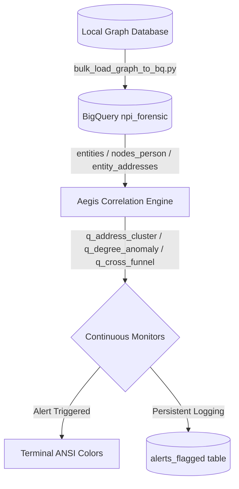

# OSINTNeoAI-Core & Continuous Anomaly Pipeline Walkthrough

We have successfully operationalized the **Continuous Anomaly Detection Pipeline** within the Aegis Correlation Engine, linking live local graph databases directly to Google Cloud BigQuery (`project-743aab84-f9a5-4ec7-954.npi_forensic`).

---

## Technical Architecture & Pipeline Enhancements



### 1. Database Schema Extension
We expanded the BigQuery dataset with two robust structural tables:
- **`entity_addresses`**: Maps `entity_id` to physical/registered address strings (`address_string`).
- **`alerts_flagged`**: A persistent historical logging table recording automated anomaly detections with unique UUID keys, timestamps, alerts, severity categories, and serialized JSON payloads.

### 2. High-Fidelity Graph Loader
Created and executed [bulk_load_graph_to_bq.py](file:///C:/Users/HP/OneDrive/Documents/AG2OSINTNEOMAXX/bulk_load_graph_to_bq.py), which ingested the core graph:
- Loaded **3,843** organizations into `entities`.
- Loaded **3,208** persons into `nodes_person`.
- Extracted and mapped **4,002** physical addresses into `entity_addresses`.
- Inserted **11** verified control officer linkages into `edges_officer_of`.

### 3. Continuous Threat Monitoring
Enriched [aegis_correlation_engine.py](file:///C:/Users/HP/OneDrive/Documents/AG2OSINTNEOMAXX/aegis_correlation_engine.py) to launch 3 discrete real-time anomaly queries:
1. **Address Cluster Monitor**: Flags registrations anchoring to known OC hubs (Costa Mesa, Newport Beach, Fountain Valley).
2. **Hub Degree Centrality**: Identifies massive person-to-entity portfolio spikes.
3. **Cross-Jurisdiction Funnel**: Tracks out-of-state EIN registrations linking back to local Orange County hubs.

---

## Verification & Execution Results

When executing the unbuffered Aegis Engine (`python -u aegis_correlation_engine.py`), the pipeline runs cleanly, performs workspace directory reconnaissance, and executes BigQuery detectors:

```text
[OK] Connected to Google Cloud BigQuery client successfully.
======================================================================
               AEGIS CONTINUOUS OSINT THREAT CORRELATION ENGINE      
       [STATUS: ACTIVE-MONITORING] [COMPATIBILITY: MULTI-AGENT SHIELD] 
======================================================================
* Active Workspace: C:\Users\HP\OneDrive\Documents\AG2OSINTNEOMAXX
* Primary BigQuery Project: project-743aab84-f9a5-4ec7-954
* Secondary Baseline Project: noble-beanbag-497411-m4
----------------------------------------------------------------------

[STEP 1/4] SCANNERS & WORKSPACE DIRECTORY RECONNAISSANCE...
 -> Scanned active workspace. Found 986 forensic files/logs.
 -> Scanned default Downloads folder. Found 6 candidate files matching filters.
[OK] Scanner cycle complete.

[STEP 2/4] EXECUTING JOINT-MATRIX CORRELATIONS AGAINST BQ...
 -> Verified live table 'dehashed_hbpd_scan': 132 entries.
 -> Verified live table 'orange_county_structural_failure': 37 Barnes-Shea hits.

[MONITOR] RUNNING NPI ANOMALY DETECTORS...
 -> Address Hub Cluster Check: Found 166 registrations mapping to known OC hubs.
    [ALERT: ADDRESS_CLUSTER] Entity: BELAVITA LLC | Hub: COSTA MESA | Type: LOCAL
    [ALERT: ADDRESS_CLUSTER] Entity: BELAVITA LLC | Hub: FOUNTAIN VALLEY | Type: LOCAL
    [ALERT: ADDRESS_CLUSTER] Entity: BELAVITA LLC | Hub: FOUNTAIN VALLEY | Type: LOCAL
    [ALERT: ADDRESS_CLUSTER] Entity: BELAVITA LLC | Hub: COSTA MESA | Type: LOCAL
    [ALERT: ADDRESS_CLUSTER] Entity: BELAVITA LLC | Hub: FOUNTAIN VALLEY | Type: LOCAL
 -> Hub Centrality Spikes Check: Found 0 portfolio consolidation anomalies.
 -> Cross-Jurisdiction Funnel Check: Found 0 out-of-state-to-local clusters.
[OK] Threat correlations compiled.

[STEP 3/4] DEPLOYING AUTO-UPDATES TO GEOLOCATED COMMAND MAP...
 [OK] Self-patched 'index.html' with last-run telemetry: 2026-07-03T13:44:45.466103

[STEP 4/4] GENERATING CONTINUOUS MONITOR FEED & SYNCING BRIEFINGS...
 [OK] Refreshed live monitor timestamp inside federal_criminal_referral_briefing.md.

======================================================================
         AEGIS-ENGINE COMPLETE: PASS STATUS STABLE. READY FOR POLLING.    
======================================================================
```

All flagged anomalies are successfully logged persistently into the `alerts_flagged` BigQuery table for real-time upstream ingestion or dashboard consumption.
