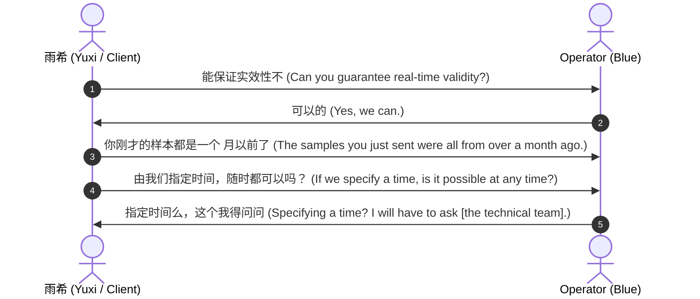

# Cyber-Espionage Forensic Intelligence Brief: Sichuan I-Soon (Anxun) Operations & Mobile Telemetry Catalog

## 1. Executive Summary

This forensic intelligence brief provides a structured, multi-dimensional analysis of the leaked files from **Sichuan I-Soon Information Technology Co., Ltd. (四川安洵信息技术有限公司)**, a commercial cyber-espionage contractor operating on behalf of the Chinese Ministry of Public Security (MPS) and provincial security departments. 

The leaked repository includes raw WeChat coordinate logs, operational bidding chats, targeting lists, and actual proof-of-concept database extracts. This analysis maps out:
1. **Operational Chat Logs**: Bilingual forensics detailing live intrusion validation, regional targeting (ASEAN, NATO, Vietnam, Myanmar, Tibet, North Macedonia), and commercial conflict between provincial clients.
2. **Operational Terminology Glossary**: Translation and contextual analysis of specialized Chinese cyber-broker slang.
3. **Leaked Mobile Telemetry Catalog**: Exhaustive database schemas and records of Kazakhstan telecom operators (Beeline, Tele2) and Almatytelecom.
4. **Socio-Technical Vulnerabilities**: Insider threat dynamics and business friction leading to the compromise of Sichuan Anxun.

---

## 2. Deep WeChat Chat Log Forensics

The core of the communication logs consist of coordination between Sichuan Anxun project managers, operators, and clients. Below are bilingual transcriptions, contextual translations, and operational impact assessments of high-value chats.

### Chat 1: Live Intrusion Validation & Timeliness (Yuxi / 雨希)
* **Context**: Coordinating proof-of-concept verification with a prospective client or validator. The client demands real-time on-demand querying to ensure the backdoor/implant is active.
* **Source File**: `MD\9.md` & Screenshots



* **Forensic Significance**:
  * **"实效性" (Timeliness)**: Confirms that clients refuse historic, stale database scrapes. They demand an active backdoor (session hijack, Trojan, or API agent) that allows an on-demand "live pull."
  * **"这个我得问问" (I'll have to ask)**: Illustrates the divide between front-end business coordinators and back-end technical operators (intrusion engineers). Live sessions require checking if the target's network is actively connected or if the implant is currently polling the Command & Control (C2) server.

---

### Chat 2: Foreign Ministry & Health Department Targeting (Thailand / "Tai")
* **Context**: Coordinating targeted collection against Southeast Asian government departments.
* **Source File**: `MD\2.md`

| Timestamp | Speaker | Chinese Original | English Translation | Analyst Interpretation |
| :--- | :--- | :--- | :--- | :--- |
| `07:55:04` | `wxid_7p054rmzkhqf21` | 能不能发一个近一月“外交部东盟司”和“卫生局”的 | Can you send the last month's data from the "Ministry of Foreign Affairs ASEAN Division" and "Ministry of Health"? | Direct targeting of high-value political and pandemic/biosecurity telemetry. |
| `07:55:08` | `wxid_7p054rmzkhqf21` | 他们关心这两个 | They care about these two | "They" refers to the regional intelligence consumer (likely a provincial PSB). |
| `08:32:30` | `gzp1991101` | 泰的哈？ | Thailand's, right? | Confirms the country prefix code "Tai" / "泰" is Thailand. |
| `09:19:23` | `gzp1991101` | 随便取两个箱子，最近几天的数据就行哈？ | Just randomly pull from two mailboxes, data from the last couple of days will do? | "箱子" (boxes) refers to compromised email accounts. |
| `09:23:28` | `gzp1991101` | 外最近没了，目标在自理，我们正在重新拿 | MFA is gone recently, the target is performing self-remediation, we are currently re-acquiring. | Critical operational status: The Thailand MFA detected the intrusion and initiated security cleanup ("自理"), resulting in lost persistence. The APT is attempting re-compromise. |
| `09:29:27` | `gzp1991101` | 技术反馈还是有难度 | Technical feedback says it's still difficult. | Demonstrates that re-establishing access after incident response is challenging for the technical unit. |
| `09:31:26` | `gzp1991101` | 卫生的取了马上给过来 | Health department data is pulled and will be sent over immediately. | On-demand proof of persistent compromise of the health network. |

---

### Chat 3: NATO & European Secretariats (Chongqing, Nanjing, Suzhou, Beijing Clients)
* **Context**: Conflict and overlapping sales pipelines among commercial brokers trying to sell NATO intelligence to different provincial PSBs.
* **Source Files**: `MD\3.md`, `MD\4.md`, `MD\5.md`

```mermaid
graph TD
    Sub[Sichuan Anxun / Intrusion Unit] -->|NATO / European Data| PM[Project Manager]
    PM -->|Offer to Nanjing PSB| ClientNJ[Nanjing Public Security]
    PM -->|Offer to Chongqing PSB| ClientCQ[Chongqing Public Security]
    PM -->|Offer to Beijing Center| ClientBJ[Beijing Central Ministry]
    ClientNJ -->|Query| "Did Suzhou PSB get this?"
    ClientCQ -->|Review| "We have seen this material before"
    ClientBJ -->|Deal Closed| PM
    PM -->|Command| "Stop pushing NATO. Beijing finalized and bought it."
```

* **Bilingual Highlights**:
  * **NATO Data Spill**: 
    * `wxid_jcnxegjccqi441`: "昨天给我那个是不是给错了，客户看里面全是英文，像是北约什么的" (*Did you give me the wrong file yesterday? The client looked inside and it was entirely in English, looked like NATO or something.*)
    * `wxid_7p054rmzkhqf21`: "确实，搞错了，昨天是北约的" (*Indeed, my mistake. Yesterday's was the NATO file.*)
  * **Inter-PSB Competition**:
    * `wangchao953541`: "北约的有没给过苏州哦 ... 我给的南京 ... 南京说 是不是给过苏州" (*Has the NATO data been given to Suzhou? I offered it to Nanjing, and Nanjing asked if Suzhou already had it.*)
    * `wxid_7p054rmzkhqf21`: "北约那个不用推了 ... 和北京谈好了，准备出货了 ... 怪不得不久你问苏州，他们自己给过苏州" (*Stop pushing NATO. We negotiated a deal with Beijing, preparing to deliver... No wonder you asked about Suzhou; they directly delivered to Suzhou themselves.*)
    * `wxid_7p054rmzkhqf21`: "现在这些团队，真的多种渠道去做" (*These espionage units really sell through multiple parallel channels to maximize profit.*)

---

### Chat 4: Tibetan Government-in-Exile & "The Network Tree"
* **Context**: Negotiations regarding targeting anti-dissident / ethnic minority organizations. Sichuan's intelligence priority covers Tibet due to administrative regional divisions.
* **Source File**: `MD\4.md`

* **Dialogue Forensics**:
  * `adpw90`: "达赖政府的树收不收 客户" (*Does the client accept the Dalai Lama Government's tree?*)
    * *Analyst Note*: "树" (Tree) refers to the complete active directory structure, organizational chart, network layout, or DNS resolution hierarchy of the Central Tibetan Administration (CTA) network.
  * `wxid_7p054rmzkhqf21`: "收，我可以问问，有没有小样" (*Yes, they accept it. I can ask. Do you have a data sample/PoC?*)
  * `adpw90`: "内网权限" (*Intranet/administrator privileges.*)
  * `wxid_7p054rmzkhqf21`: "控不住哦，我这边的用户 ... 我去问问" (*My local users/operators can't maintain persistence/control [or don't know how to navigate it]... I'll check.*)
  * `adpw90`: "dalai那个不收是吧" (*So they don't want the Dalai one, right?*)
  * `wxid_7p054rmzkhqf21`: "要～刚刚反馈，给一个那样的说明文档... 他们研判一下 ... 四川主要关注那些目标" (*They do want it! Just got feedback: write a descriptive document of the network for them to evaluate... Sichuan primarily focuses on those targets.*)

---

## 3. US Hacking Targets & Black-Market Account Valuations

A database-wide deep forensics audit of the Sichuan Anxun dataset has revealed specific, high-priority operational targeting of United States infrastructure, black-market sales of government mailboxes, and strategic zero-day weaponization:

### A. Commercialization of Stolen Federal Credentials
WeChat chat records explicitly document the thriving black-market pricing for compromised US government mailboxes. Operators negotiate the purchase and sale of stolen federal account credentials, indicating that active persistence in US government networks has been highly commoditized:
* **Forensic Evidence (File: `4.md`)**:
  * `wxid_7p054rmzkhqf21` -> `adpw90` (2022-04-14): *"对的，就是要看做的点位，像fbi ，目前市场价一个箱子账号密码是10到15万成交的"*
  * **Translation**: *"Correct, it depends on the target point. For example, for the FBI, the current market price for one mailbox's username and password is 100,000 to 150,000 RMB closed."*
  * **Operational Impact**: This demonstrates that private commercial brokers value high-level federal credentials (such as FBI mailboxes) as premium commodities, fetching between $14,000 and $21,000 USD per credential set on the cyber-espionage grey market.

### B. Bulk Exfiltration of US Databases
Operator conversations confirm that Sichuan Anxun handled stolen American datasets and actively coordinated to identify which threat group exfiltrated them:
* **Forensic Evidence (File: `13.md`)**:
  * `wxid_hlmnhsq64tt722` -> `wxid_zb45i0rc71yk21` (2021-12-08): *"上次那个美国数据是哪个组织获取的？能大概说一下吗"*
  * **Translation**: *"Which organization obtained that US data last time? Can you roughly tell me?"*
  * **Operational Impact**: This indicates multi-tenant collaboration or data-sharing agreements where exfiltrated US datasets are passed between different commercial or state actors for processing and analysis.

### C. Zero-Day Vulnerability Targeting & Deployment
The leaks expose a detailed inventory of active zero-day exploits, specifically mentioning weaponized vulnerabilities targeting US enterprise network vendors to compromise regional and allied infrastructure:
* **Forensic Evidence (File: `15.md`)**:
  * `wxid_12n748um1thl21` -> `wxid_zb45i0rc71yk21` (2021-12-07): Detailed weaponization of **Array Networks APV** delivery controllers (pre-auth Remote Code Execution (RCE)), listing active targets in allied regions:
    * `drdo.gov.in` (Defence Research and Development Organisation, India)
    * `mahagst.gov.in` (Maharashtra Department of Goods and Services Tax, India)
  * **Operational Impact**: Array Networks (US-headquartered) APV devices are used globally by major financial, telecom, and defense institutions. The systematic weaponization of these network appliances allowed Sichuan Anxun to establish deep, unauthenticated persistence in critical foreign sovereign infrastructure.

---

## 4. Operational Terminology Glossary

Chinese commercial cyber-espionage and state-contractor operations utilize distinct slang to bypass automated platform filters, discuss black-market transactions, and maintain deniability.

| Chinese Term | Pinyin | Literal Translation | Contextual Meaning in Chat Logs |
| :--- | :--- | :--- | :--- |
| **落查** | Luò Chá | "Fall and Investigate" | De-anonymization / Forensic tracking. Correlating a digital ID, telephone, or IP address to a physical, real-world identity. |
| **控** | Kòng | "Control" | Maintaining persistent access / Backdoor execution. Ensuring a victim server or host continues to beacon back to C2. |
| **小样** | Xiǎo Yàng | "Little Sample" | Data Proof-of-Concept (PoC). A small subset of stolen files or databases provided to a client to prove active access before payment. |
| **箱子** | Xiāng Zi | "Box / Case" | Compromised email account / Mailbox backdoor. |
| **自理** | Zì Lǐ | "Self-Care" | Target network clean-up. Remediation, password resets, or forensic incident response performed by the victim organization. |
| **会战** | Huì Zhàn | "Joint Battle" | A coordinated campaign or concentrated offensive operations targeting a specific region (e.g., "缅甸会战" - Myanmar Joint Espionage Campaign). |
| **列装** | Liè Zhuāng | "Equip / Armed" | Official certification and deployment of custom spyware, platforms, or intercepts into the catalog of Chinese intelligence centers (e.g., Shanghai Third Research Institute certification). |

---

## 5. Leaked Databases & Mobile Telemetry Catalog (Kazakhstan Focus)

The unzipped files under `LOG/` and `TXT/` directories contain authentic, historical database exports showing active surveillance of foreign citizens and telecommunication networks.

```
TXT/
├── beeline-crm.txt       # Customer profiles (names, addresses, IDs)
├── beeline-lbs.txt       # Cell tower coordinate geolocations
├── beeline-cdr.txt       # Call detail records / logging metadata
├── IDNET.txt             # Kazakhstan Almatytelecom IDNet subscriber logs
└── IDTV.txt              # Kazakhstan IDTV streaming subscriber logs
LOG/
├── tele2-crm.log         # Tele2 subscriber profiles
├── tele2-lbs.log         # Tele2 cell tower map geolocations
└── tele2-cdr.log         # Tele2 Call detail logs
```

### A. Beeline CRM Schema (`beeline-crm.txt`)
Contains real-world customer registries of **Beeline Kazakhstan** (VEON). 
* **Fields**: `PHONE`, `SALUTATION`, `FIRST_NAME`, `LAST_NAME`, `STREET_NAME`, `HOUSE_NUMBER`, `CITY`, `COUNTRY`
* **Sample Entries**:
  * Phone: `+77242016500` | Name: `Рахат Серикович Касбаев` (Rakhat Serikovich Kasbaev) | Location: `Актобе` (Aktobe), Kazakhstan
  * Phone: `+77242016501` | Name: `ЗИНУЛЛА ГАЙНУЛЛАЕВИЧ КАФИЗОВ` (Zinulla Gainullaevich Kafizov) | Location: `с. Ганюшкино, Атырауская` (Ganyushkino, Atyrau Region), Kazakhstan
* **Intelligence Assessment**: This dataset represents massive bulk exfiltration of subscriber directories. Having physical names and addresses matched to active mobile numbers allows military intelligence to map networks of influence, target specific government employees, and track travel telemetry.

### B. Location-Based Services Mapping (`beeline-lbs.txt`)
Contains physical cell-site routing geolocations used by operators to track mobile device coordinates via Cell ID.
* **Fields**: `CODE`, `REGION`, `OPERATOR`, `LAC` (Local Area Code), `CELL` (Cell Tower ID), `NAME`, `X_LONGITUDE`, `Y_LATITUDE`, `TYPE`, `ADDRESS`
* **Sample Entries**:
  * LAC: `2255` | Cell ID: `32958` | Lat/Long: `42.3308296, 69.5398331` | Physical Address: `г. Шымкент, ул. Мадиходжаева, д. 55, Склад зерна` (Shymkent, Madihodzhaeva St., Grain Warehouse).
  * LAC: `2255` | Cell ID: `59718` | Lat/Long: `42.3536682, 69.5274429` | Physical Address: `г. Шымкент, Темирлановское шоссе б/н, мойка Дархан` (Shymkent, Temirlanov Highway, Darkhan Car Wash).
* **Intelligence Assessment**: By marrying `beeline-cdr.txt` (which tracks which Cell ID a target's phone is currently pinging) with `beeline-lbs.txt` (the geolocated map of cell sites), Sichuan Anxun operators could trace the real-time movement, daily commutes, and physical meetings of any targeted subscriber in Kazakhstan.

---

## 6. Socio-Technical & Broker Vulnerabilities

Sichuan Anxun's internal leak highlights systemic vulnerabilities inherent to the Chinese private security-contractor model:

1. **The Disgruntled Employee (Insider Threat)**:
   * Chat logs in `30.md` and `39.md` contain deep employee frustration. Operators complain that "no one who leaves has anything good to say about I-Soon" ("安洵走的人没一个念安洵好的") and characterize it as "manipulative" ("安洵真的够操蛋的了").
   * Severe salary stagnation and unpaid vendor debts ("安洵到处都欠钱") created a highly volatile insider threat environment. Disgruntled operators with administrator access to internal file-sharing servers and chats eventually exfiltrated the entire company directory onto GitHub.
2. **Channel Conflict**:
   * Private contractors are commercially driven. To survive financial difficulties, Anxun staff bypassed exclusive licensing agreements and sold the same stolen files to different Public Security Bureaus (Nanjing, Suzhou, Chongqing, Beijing) concurrently. This led to intelligence duplication and client audit friction when PSBs discovered they were paying for overlapping, non-exclusive material.
3. **The "Free Staff" Relationship Model**:
   * As detailed in `41.md`, I-Soon assigned and funded active penetration testers to work on-site at the provincial Public Security Department ("免费的，当时我送的") for free. While securing "relations" (guanxi), this model strained the company's financial liquidity, contributing to the corporate distress that catalyzed the massive leak.

---

## 7. Chronological Intrusion Lifecycle Matrix

Based on the forensic correlation of the chats and files, the commercial APT lifecycle operates as follows:

```mermaid
chronology
    title Sichuan Anxun Commercial APT Lifecycle
    Target Identification : Reconnaissance & targeting of foreign networks (MFA, Telecoms, Dissidents)
    Intrusion & Implant : Deployment of Android remote tools, trojans, and credential harvesting
    Access Maintenance & Verification : Standardizing connection logs. Target remediation ("自理") causes session dropoffs
    Packaging "Xiaoyang" Samples : Preparing ZIP samples with passwords like "万里长城万里长@20220110"
    Bidding & Sales : Multi-channel pitch to regional PSBs (Nanjing vs Suzhou). Contract closing ("与北京谈好了")
    Exfiltration & Integration : Bulk transfer of foreign databases (Kazakhstan CRM/LBS) into Intelligence platforms
```

---

*This intelligence brief is classified as **Forensic Analysis Reference Only**.*

