# OSINT Entity Network Map — Huntington Beach RICO Investigation

```mermaid
graph TD
    subgraph "COC / Federal Funding Pipeline"
        HUD["HUD COC CA-600<br/>$155M Permanent Supportive Housing"]
        OC_COC["Orange County Continuum of Care"]
        HMIS["HMIS Database<br/>(211 OC / OC United Way)"]
        HBNC["HBNC Navigation Center<br/>17631 Cameron Ln / 17642 Beach Blvd<br/>Cr-VI Toxic Site"]
        HUD -->|funds| OC_COC
        OC_COC -->|administers| HMIS
        HMIS -->|referral pipeline| HBNC
    end

    subgraph "Mercy House Layer"
        MH["Mercy House Living Centers<br/>CEO: Larry Haynes<br/>$54.5M revenue / 93% gov grants"]
        MH_CHDO["Mercy House CHDO Inc."]
        CASA["Casa Aliento LP<br/>$15M Vagabond Inn buyer"]
        CENTURY["Century Housing Corp<br/>Private Lender"]
        CO_ORANGE["County of Orange<br/>33% of MH contributions"]
        COSTA_MESA["City of Costa Mesa<br/>Grants + Loans"]
        OXNARD["City of Oxnard<br/>$4.4M loan (10% drawn)"]
        
        MH -->|controls| MH_CHDO
        MH_CHDO -->|sold $15M property to| CASA
        MH_CHDO -->|$13.5M seller carryback| CASA
        MH_CHDO -->|paid off $1.5M note to| CENTURY
        CO_ORANGE -->|$6.5M grant paid to| CENTURY
        COSTA_MESA -->|$2M loan + grants| MH_CHDO
        OXNARD -->|undrawn loan| MH_CHDO
        MH ---|funded by| CO_ORANGE
    end

    subgraph "7561 Center Ave Complex"
        DYL["Dylan & Andrew Holdings LLC<br/>Unit J1 | $725K (2022)<br/>Mail: 15822 Garnet St, Westminster"]
        KRS["KRS Werks LLC<br/>Unit E1 | $825K (2023)<br/>Mail: 13337 South St #683, Cerritos"]
        BRWN["Brown Hubert LLC<br/>Unit D1 | $0 (2016)<br/>Mail: PO Box 531604, Henderson"]
        FREE["Freedman Enterprises LLC<br/>Unit G3 | $0 (2009)<br/>Mail: 19295 Woodlands Dr, HB"]
        TAM["Tam Nguyen<br/>Garden Grove Community Foundation<br/>ARPA grants → 2T Media"]
        GARNET["15822 Garnet St, Westminster<br/>Mailbox Drop"]
        
        DYL -->|routes mail to| GARNET
        TAM -.->|PPP footprint| DYL
    end

    subgraph "Pham $0 Conveyance Layer"
        PETER["Peter Pham / Cynthia Chau"]
        CPC["CP Premier Capital LLC"]
        CERRITOS["7100 Cerritos Ave #108<br/>$0 quitclaim (Mar 2010)"]
        SHIRLEY["13801 Shirley St #85<br/>$0 quitclaim (Apr 2010)"]
        ORCHARD["2614 Orchard Dr, Tustin<br/>Personal Residence"]
        
        PETER -->|co-owns| CPC
        CPC -->|holds| CERRITOS
        CPC -->|holds| SHIRLEY
        CERRITOS -->|routed through| ORCHARD
        SHIRLEY -->|routed through| ORCHARD
    end

    subgraph "PPP / RICO Layer"
        STEWART["Stewart Industries LLC<br/>3311 Bounty Cir, Seal Beach<br/>$0 transfer (May 2021)<br/>1077 Pacific Coast Hwy #247 CMRA"]
        TRIUMVIRATE["Triumvirate LLC<br/>21951 Brookhurst St, Fountain Valley<br/>$2.8M (Nov 2021)"]
        PREMIERE["Premiere Entertainment LLC<br/>PPP: $209K (Apr 2020)"]
        L2T["L2T Media LLC<br/>PPP: $1.05M (Apr 2020)"]
        
        TAM -.->|ARPA grants directed to| PREMIERE
        TAM -.->|ARPA grants directed to| L2T
    end

    subgraph "Key Addresses"
        BEACH["17642 Beach Blvd<br/>HBNC Toxic Site<br/>Hex Cr-VI 49x EPA limit"]
        CAMERON["17631 Cameron Ln<br/>Asphalt cap failure"]
    end

    PETER -.->|federally indicted 15 counts<br/>bribery, money laundering| GOV
    MH -.->|operates on toxic plume| BEACH
    MH -.->|operates| CAMERON

    style HBNC fill:#ff4444,color:#fff
    style BEACH fill:#ff4444,color:#fff
    style CAMERON fill:#ff4444,color:#fff
    style CASA fill:#ff9900,color:#000
    style CPC fill:#ff9900,color:#000
    style DYL fill:#ffff00,color:#000
    style KRS fill:#ffff00,color:#000
    style PETER fill:#ff4444,color:#fff
    style TAM fill:#ff4444,color:#fff
```

## Entity Index

| ID | Type | Name | Role |
|----|------|------|------|
| PER-001 | Person | Anthony Michael DiMarcello III | Primary Investigator |
| PER-004 | Person | Andrew Hoang Do | Former OC Supervisor; 5yr federal prison |
| PER-010 | Person | Peter Anh Pham | VAS founder; federal fugitive; 15 counts |
| PER-025 | Person | James Haick | Developer / contractor |
| PER-?? | Person | Tam Nguyen | Garden Grove Community Foundation President |
| PER-?? | Person | Larry Haynes | CEO, Mercy House ($186K comp) |
| NP-002 | Nonprofit | Surf City Navigation Center Inc | HBNC operator |
| NP-003 | Nonprofit | OC United / 211 OC | HMIS / referral pipeline |
| ORG-RPM | Contractor | RPM Modular | $2.2M HBNC construction contract |
| ORG-MERCY | Nonprofit | Mercy House Living Centers | $54.5M revenue / 93% from gov |
| SHL-STEWART | Shell | Stewart Industries LLC | CMRA box / $0 conveyance |
| SHL-TRIUMVIRATE | Shell | Triumvirate LLC | $2.8M capital vehicle |
| SHL-CPC | Shell | CP Premier Capital LLC | Peter Pham $0 quitclaim layer |
| SHL-DAH | Shell | Dylan & Andrew Holdings LLC | 7561 Center Ave / Garnet mailbox |
| PROP-HBNC | Toxic Site | 17631 Cameron Ln / 17642 Beach Blvd | Hex Cr-VI 49x EPA limit |
| COC-CA600 | Federal Program | HUD COC CA-600 | $155M Permanent Supportive Housing |

## Address Cross-Reference

| Address | Entities | Risk |
|---------|----------|------|
| 7561 Center Ave | Dylan & Andrew, KRS Werks, Brown Hubert, Freedman Enterprises | Multi-LLC convergence |
| 15822 Garnet St, Westminster | Dylan & Andrew mailbox drop | Mail-only layer |
| 7100 Cerritos Ave #108 | CP Premier Capital (Pham) | $0 family quitclaim |
| 13801 Shirley St #85 | CP Premier Capital (Pham) | $0 family quitclaim |
| 3311 Bounty Cir | Stewart Industries | $0 transfer + CMRA |
| 21951 Brookhurst St | Triumvirate LLC | $2.8M capital vehicle |
| 1077 Pacific Coast Hwy #247 | Stewart Industries (mail) | Commercial mail receiving agency |
| 17642 Beach Blvd | HBNC / Mercy House | Toxic plume + fraud nexus |
| 17631 Cameron Ln | HBNC | Asphalt cap failure |
