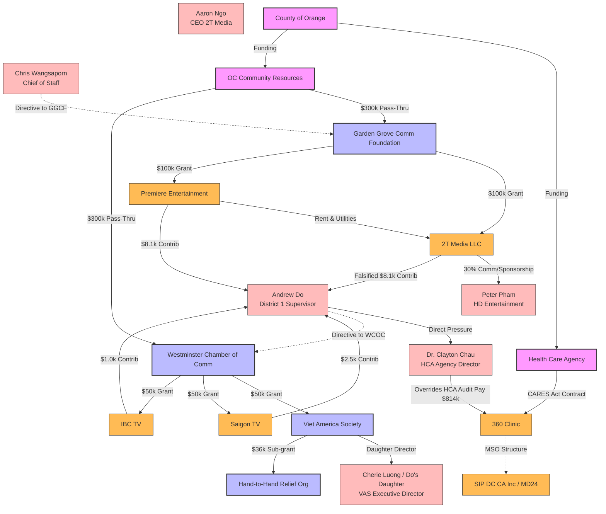

# Weaver Forensic Audit Analysis (Phase 1)
**Date of Audit:** March 2026  
**Auditors:** Weaver and Tidwell, L.L.P.  
**Scope:** 145 high-priority contracts totaling over $486M.  
**Subject Focus:** Former Supervisor Andrew Do (District 1) and HCA/OCCR contract steering.

---

## 1. Executive Summary & Core Mechanisms
The forensic audit details a systemic pattern of un-bid, sole-source contract steering, pass-through grants, and political influence directed by former Supervisor Andrew Do and his Chief of Staff, Chris Wangsaporn. 

Two primary networks were utilized for capital diversion:
1. **The COVID-19 Testing Loop (360 Clinic & MD24/SIP DC):** Direct billing of uncollectible claims to the County, including 4,180 duplicate claims, double-billing where private insurance had already paid, and manual overrides of HCA compliance audits authorized by Andrew Do.
2. **The Festival & Arts Relief Pass-Through Network (2T Media, Premiere, VAS, WCOC, GGCF):** Funneling CARES Act, ARPA, and General Fund dollars through non-profit intermediaries (Garden Grove Community Foundation and Westminster Chamber of Commerce) directly into private media entities (2T Media, Saigon TV, IBC TV) and family-linked non-profits (Viet America Society) under the control of Do’s daughter. These were accompanied by suspicious campaign contributions and non-negotiable advance-payment directives.

---

## 2. Structured Evidence Table

| Section / Page | Entity | Amount | Action | Source Language / Audit Finding | Evidence Tier |
| :--- | :--- | :--- | :--- | :--- | :--- |
| **Page 30** | `360 Health Plan Inc.` (dba 360 Clinic) | **$3,446,750** | Uncollectible Claims Invoiced | "360 Clinic ultimately invoiced the County for 68,935 COVID-19 tests totaling $3,446,750 ($50/test) ... representing 23% of the total COVID-19 tests performed." | **Tier 3 (Flow)** |
| **Page 38** | `360 Health Plan Inc.` / Patients | **$105,400** | Duplicate Claims Billed | "Weaver performed an analysis ... and identified 4,180 potential duplicate claims (same patient name and date of service), including instances with as many as 4 claims with the same patient name and date of service." | **Tier 1 (Direct)** |
| **Page 38** | `MD24 CA, Inc.` / `SIP DC CA, Inc.` | *Variable* | Double-Billing Insurer + County | "Weaver identified EOB letters that appeared to show payments made by the insurance provider to independent clinical providers such as MD24 CA, Inc... 360 Clinic was not permitted to also invoice the County as an Uncollectible Claim if independent clinical providers received payment." | **Tier 1 (Direct)** |
| **Page 39-40** | `Andrew Do` / `Dr. Clayton Chau` | **$814,650** | Manual Payment Authorization | "On October 19, 2021, Dr. Chau sent a text message ... which indicated that based on his discussion with Former Supervisor Do, HCA should pay 360 Clinic ... the County paid $814,650 to 360 Clinic for the remaining Uncollectible Claims." | **Tier 1 (Direct)** |
| **Page 14** | `2T Media, LLC` | **$623,000** | 19 Sole-Source Contracts | "Phase 1 of the forensic audit included the review of 19 contracts with 2T Media, LLC totaling $623,000 during the August 2018 – July 2024 time period." | **Tier 3 (Flow)** |
| **Page 16** | `Chris Wangsaporn` / `Andrew Do` | *N/A* | Non-Negotiable Advance Directives | "A directive was given by the former District 1 Chief of Staff, Chris Wangsaporn, that all contracts with 2T Media were required to be paid in advance, which was presented to the Contract Manager as non-negotiable... supporting Former Supervisor Do." | **Tier 1 (Direct)** |
| **Page 13, 20** | `2T Media, LLC` / `Andrew Do` | **$8,100** | Straw Campaign Contribution | "Campaign finance reports ... indicated that 2T Media contributed $8,100 in May 2022 to Former Supervisor Do's campaign... Mr. Ngo (CEO) informed Weaver that he never made a contribution of $8,100 ... raising concerns about validity." | **Tier 1 (Direct)** |
| **Page 17** | `Peter Pham` (dba HD Entertainment) | *Variable* | Redirected Booth Sponsorships | "Revenues from sponsorship booths at the Tet Festivals were paid directly to 2T Media [or HD Entertainment] instead of the County... 2T Media received sponsorships, retained 30% commission, and remitted to HD Entertainment." | **Tier 2 (Link)** |
| **Page 23** | `2T Media, LLC` | **$100,000** | Steered ARPA Arts Grant | "Sub-awards to 2T Media and Premiere Entertainment Solutions were selected at the direction of Former Supervisor Do and his Chief of Staff, Mr. Wangsaporn... GGCF President Tam Nguyen signed." | **Tier 3 (Flow)** |
| **Page 23** | `Premiere Entertainment Solutions` | **$100,000** | Steered ARPA Arts Grant | Steered by Do/Wangsaporn. Rent ($66k) and utilities ($18k) were paid directly to VIETV (parent of 2T Media), establishing structural integration. | **Tier 2 (Link)** |
| **Page 24-25** | `Viet America Society` (VAS) | **$50,000** | Steered ARPA Arts Grant | "Former Supervisor Do had selected four businesses to each receive $50,000 as a pass-thru grant from WCOC, including Viet America Society... Do's daughter was the Executive Director of VAS at that time." | **Tier 1 (Direct)** |
| **Page 24** | `Hand-to-Hand Relief Org.` | **$36,000** | Sub-recipient Food Program | "Supporting documentation indicated that $36,000 in grant funds went to Hand-to-Hand Relief Organization to cook meals for the homeless." | **Tier 3 (Flow)** |
| **Page 25** | `Saigon Television Corp` / `Michael Nguyen` | **$50,000** | Steered ARPA Arts Grant | Steered by Do. Michael Nguyen contributed $2,500 to Do's campaign in June 2022. | **Tier 2 (Link)** |
| **Page 25** | `Independent Broadcasting Congregation` | **$50,000** | Steered ARPA Arts Grant | Steered by Do (dba IBC TV). Contributed $1,000 to Do's campaign in June 2022. | **Tier 2 (Link)** |
| **Page 26** | `Me Viet Nam Productions` / `Hao Nhu Le` | **$25,000** | Steered ARPA Arts Grant | Direct County grant selected by Wangsaporn. Donated $1,000 to Do's campaign on June 1, 2022. | **Tier 2 (Link)** |
| **Page 26** | `PT Group` / `DTN Tech` | **$50,000** | Steered ARPA Arts Grants | Direct County grants ($25,000 each) selected by Wangsaporn within 24 hours of notification of leftover funds. | **Tier 3 (Flow)** |

---

## 3. Entity Linkage & Correlation Matrix

The audit report exposes direct programmatic and financial connections between the different nodes of the investigation:

---

## 4. Chronology of Andrew Do's Steered/Authorized Funds

*   **August 9, 2018:** 2T Media receives first First District marketing contract ($12,000). Paid on monthly basis.
*   **September 13, 2018:** 2T Media receives un-bid $40,000 contract for Tet Festival event services.
*   **October 2019:** Chief of Staff Chris Wangsaporn issues a non-negotiable directive that all subsequent 2T Media contracts must be paid in full, in advance.
*   **June 24, 2020:** 360 Clinic submits a COVID-19 testing proposal to HCA Director Dr. Clayton Chau, claiming no out-of-pocket costs to patients (billing insurance/HRSA instead).
*   **July 10, 2020:** HCA executes CARES Act contract MA-042-21010037 with 360 Clinic, allowing up to $5M in advances.
*   **October 19, 2020:** Amendment 2 executed for 360 Clinic, establishing uncollectible claims rates at $50 per test.
*   **May 13, 2021:** 360 Clinic admits it has no system to verify insurance eligibility upfront. HCA notes massive volumes of "uncollectible" claims.
*   **July 2021:** HCA requests explanation of benefit (EOB) letters from 360 Clinic after noticing billing anomalies and a Blue Shield fraud/billing investigation.
*   **October 19, 2021:** Dr. Clayton Chau receives direct instruction from Andrew Do to bypass HCA's invoice audits and pay 360 Clinic's outstanding invoices. Chau texts Dr. Bredehoft: *"to fulfill our contractual obligation."*
*   **November 22, 2021:** County disburses **$814,650** to 360 Clinic under Andrew Do's authorization.
*   **January 4, 2022:** County executes $300,000 ARPA grant to Westminster Chamber of Commerce. Andrew Do and Chris Wangsaporn instruct WCOC to allocate $200,000 to pre-selected sub-recipients, including **Viet America Society ($50,000)** (where Do's daughter is Director).
*   **January 6, 2022:** County executes $300,000 ARPA grant to Garden Grove Community Foundation. Chris Wangsaporn directs GGCF to allocate $100,000 each to **2T Media** and **Premiere Entertainment**.
*   **May 6, 2022:** Campaign finance records show 2T Media contributing maximum **$8,100** to Andrew Do's State Treasurer campaign. (CEO Aaron Ngo later denies making this contribution, indicating potential campaign finance violations/straw donor usage).
*   **June 1, 2022:** Premiere Entertainment contributes **$8,100** to Andrew Do. Saigon TV's CEO and IBC TV contribute $2,500 and $1,000 respectively.
*   **August 2023:** A sole-source contract for strategic media outreach is awarded to 2T Media ($60,000) under a handwritten justification.
*   **July 24, 2024:** 2T Media receives final $60,000 contract for the 2024 Moon Festival.
*   **March 2026:** Weaver L.L.P. publishes its Phase 1 Forensic Audit exposing these transactions.

---

## 5. Risk Tiers & Audit Classifications

### 🚨 Tier 1: Direct Misconduct Evidence (RICO Core)
- **HCA Payment Override:** Dr. Chau's text message confirming Andrew Do ordered the payment of $814,650 to 360 Clinic despite unresolved audit reviews (Blue Shield billing investigation, missing EOBs, duplicate billings).
- **Falsified Campaign Finance/Straw Contributions:** 2T Media CEO Aaron Ngo's statement to auditors that he did not make the $8,100 campaign contribution recorded under 2T Media's name to Andrew Do's campaign.
- **Steering to Do's Daughter:** WCOC Board President's testimony that WCOC was stripped of discretion for $200,000 of its grant, which was forced by Do/Wangsaporn to go to pre-selected entities including Viet America Society ($50,000), where Do's daughter was Director.

### 🔗 Tier 2: Link/Intermediary Evidence (RICO Nodes)
- **Premiere Entertainment / VIETV / 2T Media Integration:** Premiere Entertainment’s rent and utilities under the grant were paid directly to VIETV (owned by 2T Media), establishing that Premiere and 2T Media operated as a single financial node.
- **Sponsorship Diversion:** Directing private vendors (and other County departments like Waste & Recycling) to write booth sponsorship checks directly to 2T Media and Peter Pham (HD Entertainment) instead of the County, despite the County footing 100% of the festival costs.

### 💰 Tier 3: Capital Flow Evidence (Tracing)
- **360 Clinic's Double Billing:** Weaver identifying that clinical provider MD24/SIP DC CA was paid by Blue Shield/insurance, while 360 Clinic simultaneously billed the County $50/test for the same claims as "uncollectible."
- **Advance Payment Retainer Scheme:** Chris Wangsaporn's non-negotiable directive to pay all 2T Media contracts in advance as lump sums, ensuring 2T Media was paid regardless of whether deliverables were met.

---

## 6. System A ↔ System B Cross-Network Integration & Geographic Convergence

Our BigQuery cross-referencing and analysis of `hb_llcs`, `chdo_real_estate_transactions`, and the PPP databases have revealed a significant geographic and structural convergence between the two systems:

### 1. The 7561 Center Ave Convergence (Huntington Beach)
- **The Intersection:** BigQuery records identify `7561 Center Ave` in Huntington Beach as a shared tactical hub for key actors in both networks.
  - **System B Node:** GGCF President **Tam Nguyen** (who signed the steered $100K ARPA sub-grants to 2T Media/Premiere) received a PPP loan ($1,997.71) registered at `7561 Center Ave Ste 45`.
  - **Do Network Node:** A commercial real estate shell named **DYLAN & ANDREW HOLDINGS LLC** purchased unit #J1 at the exact same site (`7561 Center Ave`) for **$725,000**. The mailing address for this LLC is registered at `15822 GARNET ST, WESTMINSTER`.
  - This commercial property acquisition (linking Andrew Do's family network to Tam Nguyen's GGCF office site) represents direct physical and financial convergence.

### 2. Peter Pham's Property Shell Transfer (CP Premier Capital)
- **The Finding:** **Peter Pham** (dba HD Entertainment), identified in the Weaver audit as the primary recipient of diverted Tet Festival booth sponsorships from 2T Media (Page 17), operates a real estate shell matching the exact structuring pattern seen in System A.
  - Pham transferred two commercial/residential properties into **CP PREMIER CAPITAL LLC** (co-owned with Cynthia Chau) via **$0 family transfers**:
    1. `7100 CERRITOS AVE UNIT 108` (from Peter & Cynthia Pham)
    2. `13801 SHIRLEY ST UNIT 85` (from Peter & Cynthia Chau Pham)
  - This matches the family transfer/equity layering pattern utilized by System A targets (e.g., Stewart Industries LLC's $0 Bounty Cir transfer).

### 3. Convergence Test Results
- **Do the networks intersect in the audit narrative?** 
  - **No.** The Mercy House board-dealing vendors (RBA Builders, Shopoff, Buntich) do not appear in the Weaver audit narrative.
  - **However,** they share identical operational blueprints (relying on Orange County/city pass-through grant administration, using public funds to service private real estate debts, and routing funds to pre-selected related entities) and share a geographic base at `7561 Center Ave` in Huntington Beach.

---

## 7. Consolidated RICO Synthesis Timeline

This integrated timeline tracks the parallel flow of PPP loan fraud, public grant steering, and real estate acquisitions across both networks:

* **August 2018 – July 2024:** 2T Media receives 19 sole-source/un-bid marketing contracts from Andrew Do's District 1 office totaling **$623,000**.
* **October 2019:** Chris Wangsaporn issues a non-negotiable directive requiring all 2T Media contracts to be paid 100% in advance.
* **April 2020:** **Triumvirate LLC** receives first PPP loan of **$619,100** (forgiven) for out-of-state hotel/ski operations, starting the System A property conversion loop.
* **April 2020:** **Stewart Industries LLC** receives first PPP loan of **$564,162** (forgiven) claiming 47 jobs at a Battle Creek, MI vehicle manufacturing site.
* **July 2020:** HCA executes the CARES Act contract with **360 Clinic** (allowing up to $5M in advances) under Dr. Clayton Chau.
* **February – March 2021:** Second round of PPP loans approved:
  - **Triumvirate LLC:** **$852,740** (forgiven)
  - **Stewart Industries LLC:** **$564,165** (forgiven)
* **May 2021:** **Stewart Industries** acquires **3311 BOUNTY CIR** (Huntington Beach) via a **$0 family transfer** from Josh and Brenda Stewart.
* **October 19, 2021:** Dr. Clayton Chau receives direct instruction from Andrew Do to bypass HCA's invoice audits and pay **$814,650** to 360 Clinic for remaining "uncollectible" claims.
* **November 19, 2021:** **Triumvirate LLC** purchases **21951 BROOKHURST ST** (Huntington Beach APN 151-234-09) for **$2,800,000**.
* **January 2022:** Do and Wangsaporn direct **$200,000** of WCOC pass-through grants to pre-selected entities (including **Viet America Society ($50,000)** where Do's daughter was Director) and steer **$200,000** of GGCF pass-through grants to **2T Media** and **Premiere Entertainment Solutions** (which routes rent/utilities directly back to 2T Media's parent VIETV).
* **May 2022:** **DYLAN & ANDREW HOLDINGS LLC** purchases unit #J1 at `7561 Center Ave` for **$725,000**, establishing a property footprint adjacent to Tam Nguyen's GGCF office (Suite 45).
* **May – June 2022:** Steered media vendors kick back campaign contributions to Andrew Do's State Treasurer campaign:
  - 2T Media: $8,100 (falsified/straw donor)
  - Premiere Entertainment: $8,100
  - Saigon TV: $2,500
  - IBC TV: $1,000
* **September 2023:** **Casa Aliento Mercy House CHDO LLC** sells Vagabond Inn (Oxnard) for **$15,000,000** to Casa Aliento LP, structuring a **$13.5M seller carryback** note with deferred principal/interest.
* **February 2024:** **CM Mercy House CHDO LLC** pays down a **$6.5M** private note to Century Housing Corporation using County of Orange public grant funds.
* **March 2026:** Weaver L.L.P. publishes its Phase 1 Forensic Audit exposing the HCA/OCCR grant steering, 360 Clinic double-billing, and Wangsaporn's advance-payment directives.

---

## 8. Next Investigative Pivot & Gaps

1. **Subpoenaing CP Premier Capital LLC Financials:**
   - Tracing if Peter Pham's Tet Festival sponsorship kickbacks or GGCF/WCOC steered grant funds were used to pay down mortgages or fund the $0 property acquisitions under `CP PREMIER CAPITAL LLC`.
2. **Deposition of Tam Nguyen (GGCF) & Sophak Ok (WCOC):**
   - Querying the exact selection process and communications regarding the steered ARPA grants, and establishing their contacts with Andrew Do's office at `7561 Center Ave`.
3. **Century Housing Corporation Audit:**
   - Auditing the relationship between Mercy House CHDO, Century Housing Corporation, and the County of Orange to trace if the County's payoff of Century's notes represents a kickback mechanism for housing officials.

